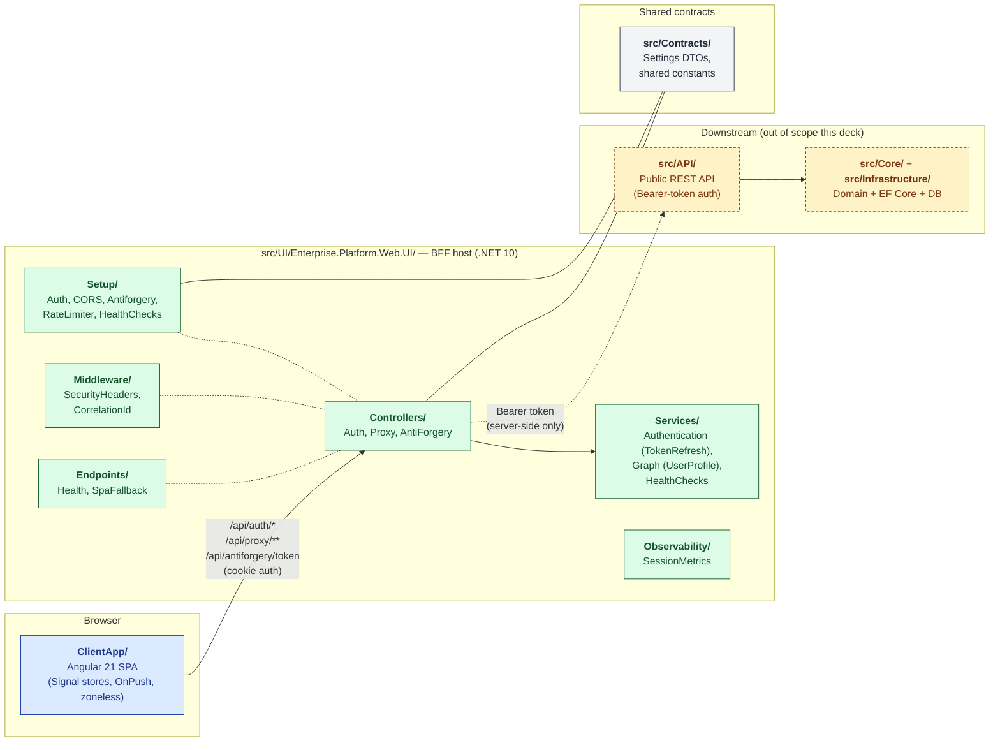

# Architecture Demo Deck — UI + BFF

> Audience: engineers and architects.
> Format: walk-through via diagrams (no live app demo).
> Scope: **UI (Angular) + BFF (.NET 10 Web.UI host)**. The downstream API, DB, Workers, and Azure infra are treated as **black boxes** — a separate deck will go deep on those.

This folder is a self-contained presentation. Open the `.md` files in VS Code (with the *Markdown Preview Mermaid Support* extension) or push to GitHub — both render Mermaid inline.

---

## How the deck is structured

The deck answers four questions, in order:

| # | Question | Doc |
|---|----------|-----|
| 1 | **Where does my code live?** (folders, what each owns, where to add a feature) | [01 — System Context](./01-System-Context.md) |
| 2 | **What happens when a user types the URL?** (cold load → auth → dashboard) | [02 — Cold Load + First Auth](./02-Flow-Cold-Load-And-Auth.md) |
| 3 | **What happens on every authenticated request?** (interceptor chain → proxy → token swap → DTO back) | [03 — Authenticated Request Flow](./03-Flow-Authenticated-Request.md) |
| 4 | **What's holding it together?** (cross-cutting concerns, design tradeoffs, tech choices) | [10 — Cross-Cutting + Tradeoffs](./10-Cross-Cutting-And-Tradeoffs.md) |

Full set: **12 docs · ~50 diagrams · ~80 tables · 0 PNGs**. Index at the bottom.

---

## How the diagrams are drawn

| Tool | Where | Why |
|---|---|---|
| **Mermaid** | Inside every `.md` (` ```mermaid ` blocks) | Text-based, version-controlled, renders in GitHub + VS Code with no plugin install for reviewers. Sequence + flowchart + class + state. |
| **Plain Markdown tables** | Tradeoff callouts, tech matrices | Force concise comparison; survive PDF export. |
| **One bespoke animated SVG** *(planned, doc 02)* | Hero "follow the request" diagram | Show a token literally travelling Browser → BFF → API → Browser. CSS `@keyframes` along an SVG path. |

There are **no PNG screenshots** anywhere in the deck — every diagram is text. Renaming a folder won't break a screenshot, and a 1-line edit to a Mermaid block surfaces in `git diff`.

---

## Conventions used in every diagram

- **Blue blocks** = browser-side (SPA, browser cookie jar)
- **Green blocks** = our .NET hosts (Web.UI BFF; downstream API in some diagrams)
- **Amber blocks** = Microsoft Entra ID (external IdP)
- **Grey blocks** = infra we don't own at runtime (CDN, load balancer)
- **Solid arrows** = synchronous HTTP
- **Dashed arrows** = redirects (3xx) or asynchronous events
- **Lock icon `🔒`** would mean cookie-bearing — we use the literal text `[cookie]` instead, since this deck is emoji-free per house style.
- **Bold path** = code path: e.g. **`Setup/PlatformAuthenticationSetup.cs`**. Click the link in the doc to jump.

Every block names the file or class that owns the behavior. The deck is meant to survive code review — if a name in a diagram drifts from reality, the diagram is the broken thing.

---

## Quick map (folder → responsibility)



---

## Full deck

| File | Diagrams | Highlights |
|---|---|---|
| [`00-INDEX.md`](./00-INDEX.md) | Quick map | Navigation + conventions |
| [`01-System-Context.md`](./01-System-Context.md) | 6 | Bird's-eye, deployment, trust boundary, BFF + SPA internals, tradeoffs |
| [`02-Flow-Cold-Load-And-Auth.md`](./02-Flow-Cold-Load-And-Auth.md) | 5 | Cold load, OIDC dance, authenticated bootstrap, returning-user fast path |
| [`03-Flow-Authenticated-Request.md`](./03-Flow-Authenticated-Request.md) | 6 | Interceptor chain, proxy hop, error normalization, cache+dedup, timing |
| [`04-Flow-Token-Refresh-And-Logout.md`](./04-Flow-Token-Refresh-And-Logout.md) | 5 | OnValidatePrincipal, failure modes, single sign-out, cross-tab broadcast |
| [`05-WebUI-Internals.md`](./05-WebUI-Internals.md) | 7 | Composition root, folder map, named HttpClients, CSP, rate limiter, health, SPA fallback |
| [`06-Angular-App-Structure.md`](./06-Angular-App-Structure.md) | 5 | Folder rules, import direction, signal-store anatomy, decision tree |
| [`07-Angular-Routing-And-Guards.md`](./07-Angular-Routing-And-Guards.md) | 4 | Route tree, guard composition, lazy/preload, route metadata |
| [`08-Angular-HTTP-Stack.md`](./08-Angular-HTTP-Stack.md) | 2+7 tables | Reference card, opt-out matrix, XSRF wiring, BaseApiService pattern |
| [`09-Angular-Layout-And-Chrome.md`](./09-Angular-Layout-And-Chrome.md) | 5 | App-shell, navbar config, sub-nav orchestrator, banners, multi-domain swap |
| [`10-Cross-Cutting-And-Tradeoffs.md`](./10-Cross-Cutting-And-Tradeoffs.md) | 4+4 tables | Correlation, security layers, error model, future-hardening map |
| [`11-Tech-Stack-Matrix.md`](./11-Tech-Stack-Matrix.md) | 1+7 tables | Per-layer language/framework/library/why with versions |

---

## Reading order suggestions

- **30-min architects' tour:** `00 → 01 → 02 → 10 → 11`
- **2-hour engineers' deep dive:** sequential `00 → 11`
- **Onboarding a new dev:** `06 → 07 → 08 → 02 → 03` (tour the SPA first, then see how it talks to the BFF)
- **Security review:** `01.3 → 02.3 → 02.4 → 04.4 → 05.4 → 10.2`
- **"Where would I add X?":** `06.5 → 05.2 → 08.6`

---

## Demo-day checklist

Before walking into the room:

- [ ] Run `npm run build:dev` so the SPA bundle exists in `dist/` (in case anyone asks to see something live)
- [ ] Open `00-INDEX.md` in VS Code with Markdown Preview Mermaid Support installed
- [ ] Have the local repo open with `Setup/PlatformAuthenticationSetup.cs` and `core/auth/auth.service.ts` already in tabs — these are the two files you'll most likely jump into during questions
- [ ] If presenting on a projector, switch VS Code to one of the high-contrast preview themes (Mermaid renders crisper)

Each doc ends with a **"Demo script (talking points)"** section listing 5–8 anticipated Q&A pairs — use it to control pacing during the live walk-through.
