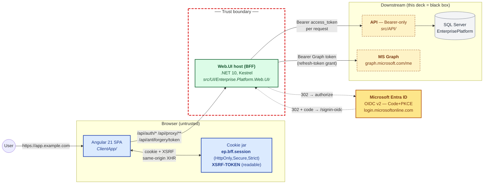
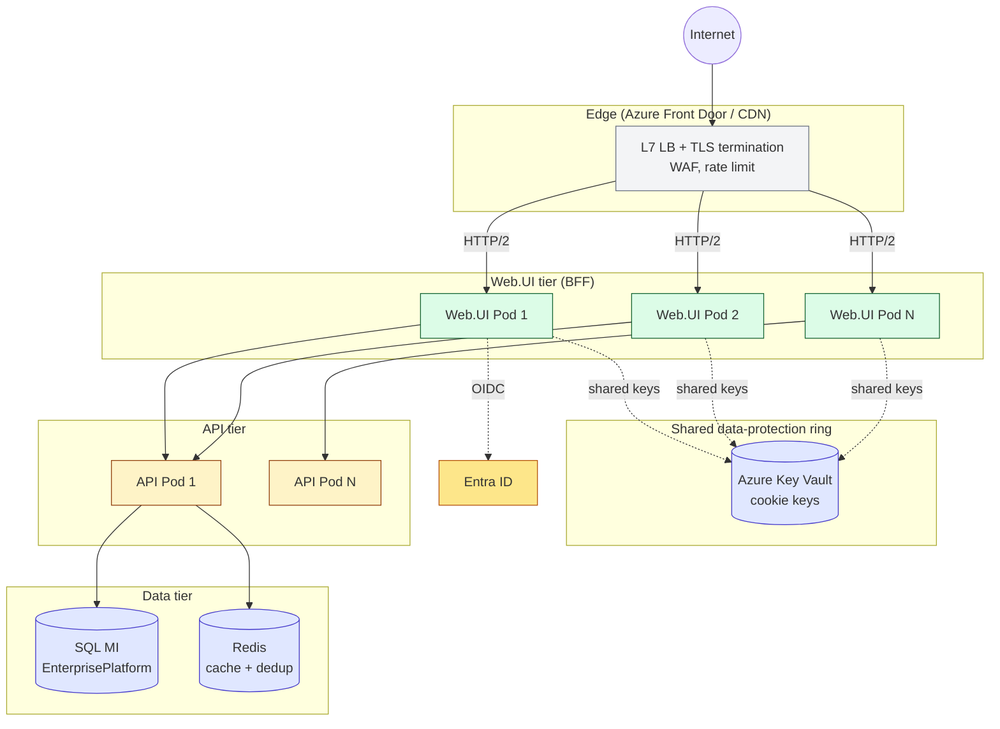
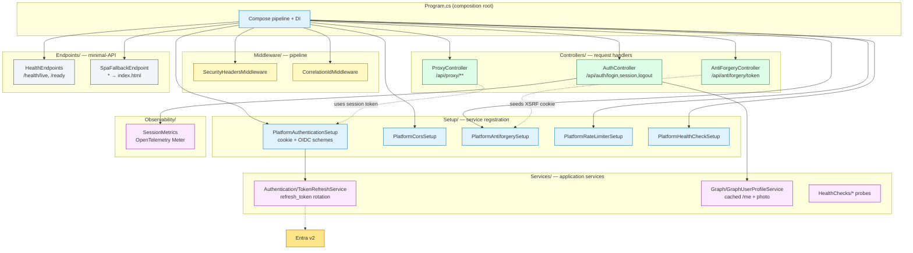
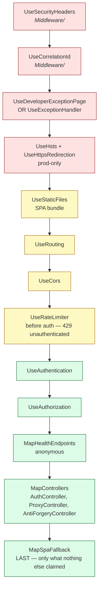
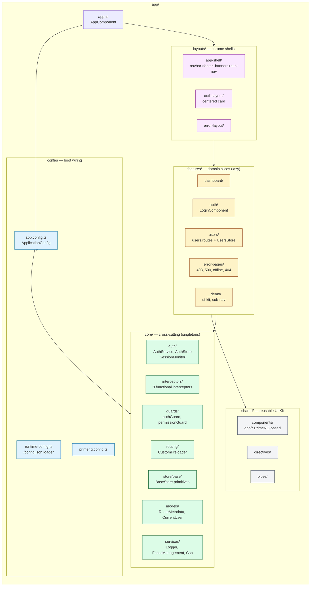

# 01 — System Context

> What lives where, who calls whom, where the trust boundary is.
> 5 diagrams: bird's-eye, deployment, trust boundary, BFF internals, SPA internals.

---

## 1.1 — Bird's-eye context (zoom level 0)

The whole world in one picture. Memorize this — every other diagram is a zoom-in on one of these blocks.



**Read this as:**
1. Browser only ever talks to **one origin** (the BFF). No CORS preflights to APIs, no token in JS.
2. Anything past the **red dashed line** is server-side and trusted. Tokens, refresh tokens, ClientSecret all live there.
3. Entra is the only third party in the OIDC trust path. Graph is opportunistic (used to enrich `/me` profile, not for auth).
4. The downstream API and DB are intentionally fuzzy — they have their own deck.

### Tradeoff: BFF vs SPA-with-MSAL

We previously ran MSAL-in-browser. We migrated to BFF in Phase 9. Why:

| Aspect | MSAL-in-browser (rejected) | BFF cookie-session (current) |
|---|---|---|
| Token exposure | Access token in JS → XSS = full account compromise | Token never leaves the server |
| Refresh strategy | Silent iframe refresh (broken by ITP/Safari) | Server-side refresh on each request via `OnValidatePrincipal` |
| CORS surface | SPA must talk to API + Entra + Graph cross-origin | Single same-origin (`/api/*`) |
| Logout | Best-effort — token in localStorage might survive | Cookie clear is atomic + SLO via `id_token_hint` |
| Cost | More client code, more browser-side state | More server work (token rotation), simpler client |

The cost we accept: the BFF host is **stateful per-user** (the cookie ticket holds tokens). Mitigation: the host is horizontally scalable behind data-protection key-ring sharing (Phase 9 adds this, ref `Docs/Architecture/BFF-Session-Flow.md`).

---

## 1.2 — Deployment topology

The same architecture, drawn for production.



**Why the data-protection ring matters:** the BFF cookie ticket is encrypted with a per-app key. If pod A issues a cookie with its key and pod B (different key) gets the next request, pod B can't decrypt it → the user is silently signed out. Sharing the ring through Key Vault (Phase 9) eliminates this.

**Why Redis is in the API tier, not the BFF:** the BFF holds *session* state (cookie ticket). Application cache (cache-aside, dedup, idempotency keys) belongs to the API. The two never share a connection string — different blast radii.

**TLS:** terminated at the L7 LB. The BFF runs HTTP between the LB and itself; HTTPS redirection is conditionally disabled in dev (see `Program.cs:100-103`).

---

## 1.3 — Trust boundary, in detail

What crosses each boundary, what doesn't.

```mermaid
flowchart LR
  classDef trusted   fill:#dcfce7,stroke:#166534;
  classDef untrusted fill:#fee2e2,stroke:#991b1b;

  subgraph Untrusted["Untrusted zone (browser)"]
    direction TB
    JSCode["JS code, DOM, devtools"]:::untrusted
    LStorage["localStorage / sessionStorage<br/><b>(MUST NOT hold tokens)</b>"]:::untrusted
    CookieJar["HttpOnly cookies<br/>(JS cannot read)"]:::untrusted
  end

  subgraph Trusted["Trusted zone (BFF + downstream)"]
    direction TB
    Ticket["Cookie ticket (encrypted)<br/>holds id+access+refresh tokens<br/>via SaveTokens=true"]:::trusted
    APIProxy["Proxy controller<br/>cookie → Bearer swap"]:::trusted
    KeyVault["Azure Key Vault<br/>ClientSecret, signing keys"]:::trusted
  end

  JSCode -- "may read" --> LStorage
  JSCode -- "CANNOT read" -.x CookieJar
  CookieJar -- "auto-sent on same-origin XHR" --> Ticket
  Ticket -- "GetTokenAsync('access_token')" --> APIProxy
  APIProxy -- "Authorization: Bearer ..." --> Trusted

  Trusted -- "NEVER returns token<br/>to browser" -.x Untrusted
```

**Invariants we enforce:**
1. The browser **never** sees a Bearer token. Verified by reading `auth.service.ts` — every method returns `SessionInfo` with no token field.
2. JS **never** reads `ep.bff.session`. Enforced by `HttpOnly=true` on cookie set in `PlatformAuthenticationSetup.cs:114`.
3. The XSRF token **is** readable by JS — that's the whole point of the double-submit pattern. It lives in `XSRF-TOKEN` cookie (no `HttpOnly`) and is echoed in `X-XSRF-TOKEN` header. CSRF defense, not auth.
4. Refresh tokens **never** leave the BFF. The `TokenRefreshService` calls Entra's token endpoint server-side via the named HTTP client.

---

## 1.4 — BFF host — internal block diagram

Inside the green block from §1.1.



**Convention:** every cross-cutting concern lives in `Setup/Platform*.cs` as a `public static IServiceCollection AddPlatform*(...)` extension. `Program.cs` is then a flat list of `AddPlatformX()` calls — no nested DI configuration. Adding a new concern = new `Setup/PlatformX.cs` + one `AddPlatformX()` line in `Program.cs`. (Canonical: `Docs/Architecture/API-Program-cs-Reference.md`.)

**HTTP pipeline order, top-to-bottom in `Program.cs:73-157`:**



**Order tradeoffs:**
- `UseRateLimiter` *before* `UseAuthentication` — abusers get 429 without ever touching the OIDC pipeline (saves Entra round-trips).
- `UseStaticFiles` *before* `UseRouting` — the SPA bundle is served as flat files, no MVC pipeline overhead.
- `MapSpaFallback` *last* — by `MapControllers` time, every API/auth/health path has had a chance to claim the request. Fallback only catches deep-links into the SPA router (e.g. `/dashboard/users/42` on a hard refresh). Uses `MapFallback("/{**catchAll}", ...)` — *not* the single-arg overload, which silently excludes file-extensioned paths via `{*path:nonfile}` (a memorialized footgun).

---

## 1.5 — Angular SPA — internal block diagram

Inside the blue block from §1.1.



**Folder rules — strict:**

| Folder | What goes there | What doesn't |
|---|---|---|
| `config/` | Boot-time providers, runtime config, third-party defaults | Anything stateful at runtime |
| `core/` | Singletons used app-wide (auth, HTTP, routing) | Domain components, feature templates |
| `features/` | Lazy domain slices (one folder per top-level route) | Cross-feature shared UI |
| `layouts/` | Chrome that wraps a route subtree (navbar, footer) | Page-specific UI |
| `shared/` | Generic, configurable UI kit (no domain knowledge) | Anything that imports from `features/*` |

**Import direction is one-way:** `features → core/shared`, never reverse. `core` and `shared` peers don't import each other except through public `index.ts` barrels. This is enforced by `dependency-cruiser` at lint time.

**Why not NgRx?** Signal stores (custom, in `core/store/base/`) cover server-state caching, dedup, and selectors with ~200 LoC per store and zero RxJS BoilerPlate®. Tradeoff: no time-travel devtools, no Redux ecosystem. Acceptable because every store is small and inspectable in Angular DevTools.

**Why PrimeNG + Tailwind v4?** Documented in `UI-Styling-Strategy.md` (17:1 score vs purchased templates). Briefly: PrimeNG gives a~70-component baseline (table, dialogs, tree, calendar) with the `pt` API for per-instance overrides; Tailwind v4 cssLayer composes underneath without `!important` wars. We use `--ep-*` design tokens in `:root` so re-skinning a tenant is one CSS file.

---

## 1.6 — Tradeoff summary (architects' cheat-sheet)

| Decision | Picked | Rejected | Why |
|---|---|---|---|
| Auth model | BFF cookie + server token swap | MSAL-in-browser | Token-out-of-browser; simpler logout; works on Safari ITP |
| BFF proxy implementation | Hand-rolled `ProxyController` | YARP | Footprint; explicit auth swap is easier to read while foundation is stabilizing. YARP is a future swap — see `ProxyController` XML doc. |
| Antiforgery | Double-submit cookie + `[AutoValidateAntiforgeryToken]` | Synchronizer-token-only | Plays well with stateless ProxyController; SPA doesn't need a session-bound token cache |
| State management | Custom signal stores | NgRx | Zoneless + signals + smaller surface; Phase-6 docs catalog the pattern |
| UI baseline | PrimeNG + Tailwind v4 cssLayer | Material, Bootstrap, Telerik | Component breadth + token-driven theming; `Docs/Architecture/UI-Styling-Strategy.md` |
| Diagram tooling | Mermaid in markdown | draw.io PNGs | Diff-able, no binary churn, renders in GitHub |
| BFF web framework | ASP.NET Core 10 minimal-API + MVC controllers | Pure minimal-API | `[AutoValidateAntiforgeryToken]` filter requires `AddControllersWithViews`; controllers are ergonomic for small handler sets |
| Logging | Serilog + OpenTelemetry | App Insights direct | Vendor-neutral sink; `StructuredLoggingSetup` is shared by API/Worker/Web.UI |
| Token refresh | `OnValidatePrincipal` cookie hook | Background timer | Refresh runs on the request that needs it — no idle-refresh churn, no clock drift |

That's enough scaffolding to navigate the rest of the deck. Continue to **[02 — Cold Load + First Auth](./02-Flow-Cold-Load-And-Auth.md)** to see what happens when a user types the URL.
