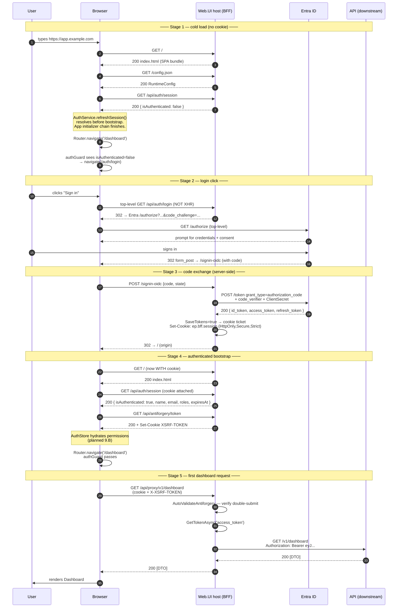
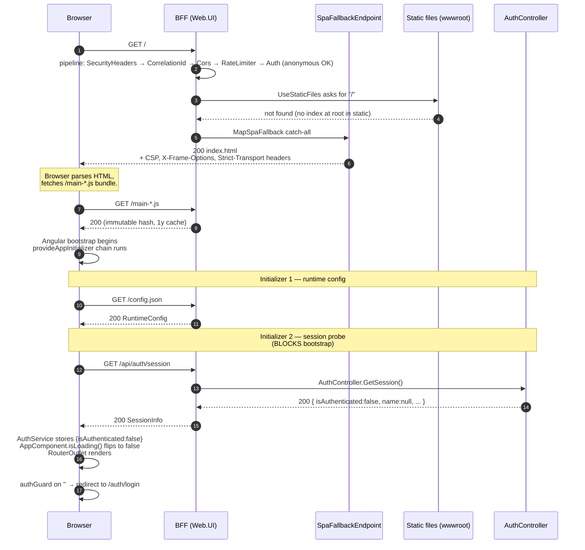
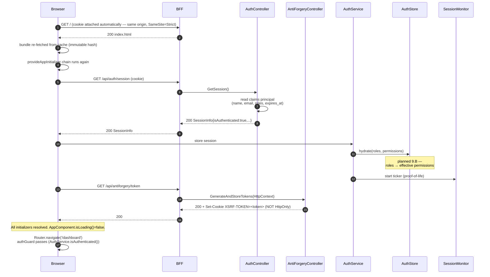
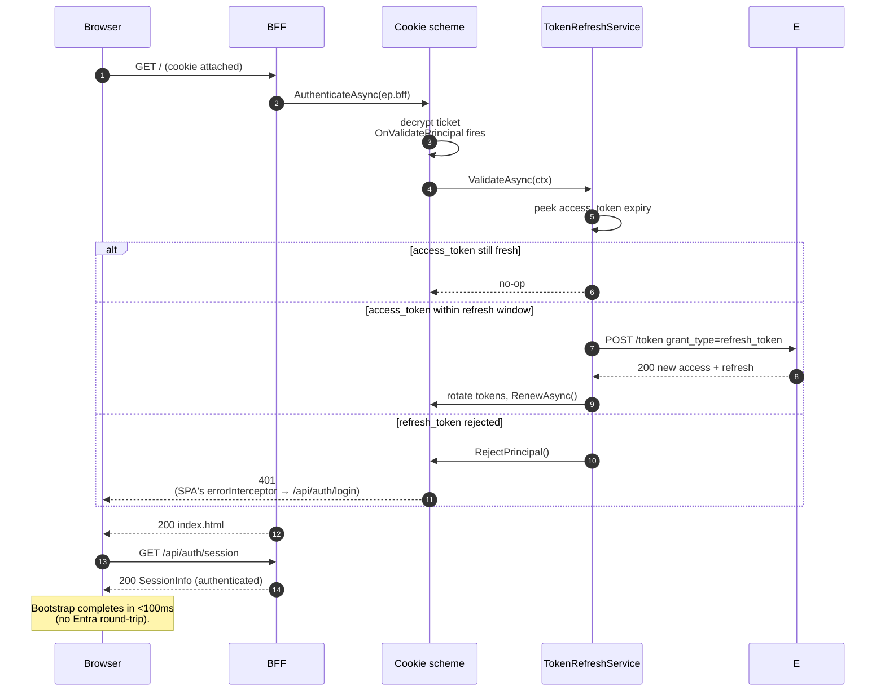

# 02 — Cold Load + First-Time Authentication

> "User types `https://app.example.com` in the address bar — what happens?"
> 4 sequence diagrams: cold load, first-time login, the OIDC callback dance, returning-user fast path.

---

## 2.1 — The hero diagram (overview)

The whole journey from "browser opens tab" to "Dashboard renders". Read top-to-bottom; the three coloured swim lanes are the actors.



There are five logical stages — anyone reading this should be able to point to which stage explains a given log line.

---

## 2.2 — Stage 1 detail: cold load (anonymous)

The very first paint. Goal: get the SPA running and find out *whether* we have a session, with no flash of protected content.



**Why probe `/api/auth/session` *before* bootstrap?**

- Without it, `AppComponent` would flicker — render the protected layout for one frame, the guard would fire, then redirect. With the probe, the first render is already correct.
- `AppComponent` template (`app.ts:33-43`) shows a centred spinner *while* `isLoading()` is true, then swaps in `<router-outlet/>`. The probe drives that gate.
- Failure-tolerant: if `/api/auth/session` errors (network, 5xx), the initializer still resolves; the user is treated as anonymous and the next 401 from any interceptor will kick them to login. We never block boot on auth.

### Files involved (clickable for the live demo)

| Step | File |
|---|---|
| Pipeline order | [`Program.cs`](../../../src/UI/Enterprise.Platform.Web.UI/Program.cs) lines 73–157 |
| Static + SPA fallback | [`Endpoints/SpaFallbackEndpoint.cs`](../../../src/UI/Enterprise.Platform.Web.UI/Endpoints/SpaFallbackEndpoint.cs) |
| Initializer chain | [`config/app.config.ts`](../../../src/UI/Enterprise.Platform.Web.UI/ClientApp/src/app/config/app.config.ts) lines 159–199 |
| Session probe | [`core/auth/auth.service.ts`](../../../src/UI/Enterprise.Platform.Web.UI/ClientApp/src/app/core/auth/auth.service.ts) `refreshSession()` |
| Loading gate | [`app.ts`](../../../src/UI/Enterprise.Platform.Web.UI/ClientApp/src/app/app.ts) |

---

## 2.3 — Stage 2 + 3 detail: the OIDC dance

When the user clicks **Sign in**, this is what fires. The key is that **`/api/auth/login` is a top-level navigation**, not an XHR — the browser actually changes URL. That's the only way Set-Cookie on `/signin-oidc` survives the redirect chain.

```mermaid
sequenceDiagram
  autonumber
  participant B as Browser
  participant H as BFF
  participant AC as AuthController
  participant Cookie as Cookie scheme<br/>(ep.bff)
  participant Oidc as OIDC scheme<br/>(ep.oidc)
  participant E as Entra v2

  B->>H: window.location = /api/auth/login
  H->>AC: Login(returnUrl?)
  AC->>AC: validate prompt allowlist<br/>(login | consent | select_account)
  AC->>Cookie: Challenge(OidcScheme, props)
  Cookie->>Oidc: forward challenge (DefaultChallenge=ep.oidc)
  Oidc->>Oidc: OnRedirectToIdentityProvider<br/>build redirect_uri (loopback aware)<br/>attach prompt if present
  Oidc-->>B: 302 Location: login.microsoftonline.com/.../authorize?<br/>response_type=code&code_challenge=...&scope=openid+profile+offline_access+<ApiScope>

  B->>E: GET /authorize (top-level)
  E-->>B: HTML login page
  B-->>E: POST credentials
  E-->>B: 302 (form_post) Location: https://app/signin-oidc<br/>+ HTML form auto-submit {code, state}
  B->>H: POST /signin-oidc (form-encoded)

  H->>Oidc: handle callback
  Oidc->>E: POST /token<br/>grant_type=authorization_code<br/>+ code, code_verifier, ClientSecret
  E-->>Oidc: 200 { id_token, access_token, refresh_token }
  Oidc->>Oidc: validate id_token (signature, iss, aud, nonce)<br/>build ClaimsPrincipal<br/>NameClaimType="name", RoleClaimType="roles"
  Oidc->>Cookie: SignIn(principal, SaveTokens=true)
  Cookie->>Cookie: OnSigningIn — stash session_started_at,<br/>SessionMetrics.SessionsCreated.Add(1)
  Cookie-->>B: Set-Cookie: ep.bff.session=<encrypted ticket><br/>HttpOnly; Secure; SameSite=Strict
  Cookie-->>B: 302 Location: /  (returnUrl-validated)

  B->>H: GET / (with new cookie)
  Note over B,H: Stage 4 — re-bootstrap.
```

**Things to point out during the demo:**

1. **PKCE is mandatory** (`UsePkce = true` in `PlatformAuthenticationSetup.cs:195`). Even though we're a confidential client (we have a `ClientSecret`), PKCE adds defense against authorization-code interception.
2. **`response_mode=form_post`** is chosen instead of `query`. The code arrives in the request body, so it doesn't appear in browser history, server access logs, or Referer headers. Trade: must `MapPost("/signin-oidc")`.
3. **Scopes:** `openid profile offline_access <ApiScope>`. Notably **no Graph scopes**. Entra issues *one* access token per resource per request — mixing scopes from two resources gives you a token usable against neither. Graph is fetched separately by `GraphUserProfileService` using a refresh-token grant for the Graph resource. (This was a memorialized bug — see memory `feedback_entra_one_resource_per_token.md`.)
4. **`SaveTokens=true`** — the cookie ticket is encrypted and now contains id+access+refresh tokens. They never reach the browser; the browser only ever sees the opaque encrypted blob in `ep.bff.session`.
5. **Redirect-URI computation** has a localhost branch (`OnRedirectToIdentityProvider`, line 245) — if the host is `localhost`/`127.0.0.1`, force HTTP scheme to match the App Registration's localhost redirect URI. (Memorialized in `feedback_entra_redirect_uri_gotchas.md`.)

### Tradeoff: `prompt` allowlist

The `AuthController.Login` accepts an optional `prompt` query parameter (e.g. `prompt=select_account`) and forwards it to Entra. Without an allowlist, an attacker could craft `?prompt=anything` and alter the IdP UX. We allow exactly `{login, consent, select_account, none}` — anything else is rejected at the controller and never reaches Entra. The validated value is stashed in `AuthenticationProperties.Items[".ep.bff.prompt"]` and the OIDC event reads it back.

---

## 2.4 — Stage 4 detail: authenticated bootstrap

After the redirect to `/`, the browser does the same cold-load dance — but **now with the cookie**. The session probe returns `isAuthenticated: true` and routing continues without bouncing to `/auth/login`.



**The double-submit XSRF setup, simplified:**
- `XSRF-TOKEN` is a *readable* cookie (no `HttpOnly`). Angular's built-in `HttpXsrfInterceptor` (wired in `app.config.ts:128-131`) reads it on every same-origin mutating XHR and copies the value into the `X-XSRF-TOKEN` request header.
- The BFF's `[AutoValidateAntiforgeryToken]` filter on `ProxyController` (and any future controller) compares the cookie value to the header value. Match → 200. Miss → 400 BadRequest.
- An attacker on `evil.com` cannot read the cookie (same-origin policy) and so cannot forge the header. The cookie alone is useless because the header is required.

**Why `SameSite=Strict` on the session cookie even with XSRF?** Defense in depth. SameSite=Strict blocks cross-site sub-requests entirely — XSRF is the second line. SameSite=Lax would still allow GETs from external sites; for an SPA that's mostly XHR, Strict has no UX cost.

---

## 2.5 — Returning-user fast path

Subsequent visits — the cookie is already there, no IdP round-trip.



**The `OnValidatePrincipal` hook is the heart of this design.** It runs on *every* authenticated request, but does work only when the access token is near expiry. The BFF host is therefore stateless across pods *as long as* the data-protection key ring is shared (so any pod can decrypt any cookie) — see §1.2.

**Failure modes** (worth flagging on the slide):
- **Refresh token revoked at IdP** (admin action, password change): `TR.ValidateAsync` calls `RejectPrincipal()`, the cookie ticket is dropped, the next browser request gets 401, the SPA redirects to `/api/auth/login`, fresh OIDC flow starts.
- **Network blip to Entra during refresh**: `TR.ValidateAsync` should swallow transient errors (Polly retry on the named HTTP client) and continue serving with the existing token until the next request retries. Hard fail = 401 only after persistent failure. *(verify in code — `Services/Authentication/TokenRefreshService.cs`)*
- **Clock skew between BFF and Entra**: a small leeway (~5min) is acceptable; OIDC handler defaults handle this. Mention this is why we don't refresh at *exact* expiry.

---

## 2.6 — Demo script (talking points)

If you're running this deck live, the natural demo flow:

1. **Open §2.1 hero diagram.** Walk the five stages in order. Spend 30s per stage.
2. **Drop into §2.2** when someone asks "but why probe before bootstrap?" Show `app.ts` lines 33–43 in the editor — the spinner gate is a 12-line snippet.
3. **Drop into §2.3** when someone asks "where does Entra come in?" The interesting bits:
   - top-level navigation vs XHR (this trips up everyone the first time)
   - PKCE+ClientSecret being belt-and-braces
   - "one resource per token" — wave at memory `feedback_entra_one_resource_per_token.md`
4. **Drop into §2.5** when someone asks about session lifetime. Refresh-on-validate is more elegant than a background timer.

Anticipated questions and where they're answered:

| Q | A |
|---|---|
| "What if the bundle is cached but the cookie is gone?" | §2.2 — session probe returns `isAuthenticated:false`, guard kicks to login |
| "What if the user has the dashboard tab open and signs out in another tab?" | §04 (next doc) — `BroadcastChannel('ep:auth')` syncs logout across tabs |
| "What if the access token expires mid-session?" | §2.5 — `OnValidatePrincipal` rotates it transparently |
| "How do we stop CSRF when the cookie auto-attaches?" | §2.4 — XSRF double-submit pair |
| "Where does Microsoft Graph fit in?" | §03 (next doc) — `GraphUserProfileService` uses refresh-token grant for `User.Read` |
| "How do we share the cookie across multiple BFF pods?" | §1.2 — Azure Key Vault data-protection key ring |
| "Why is `/signin-oidc` a POST and not a GET?" | §2.3 — `response_mode=form_post`, code stays out of URLs |

---

Continue to **03 — Authenticated Request Flow** *(next)*: interceptor chain, proxy hop, token swap, error normalization.
