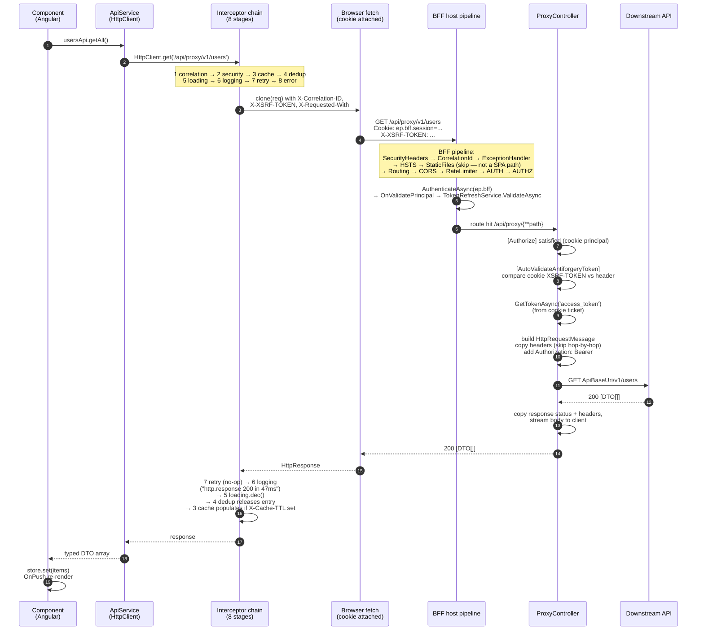
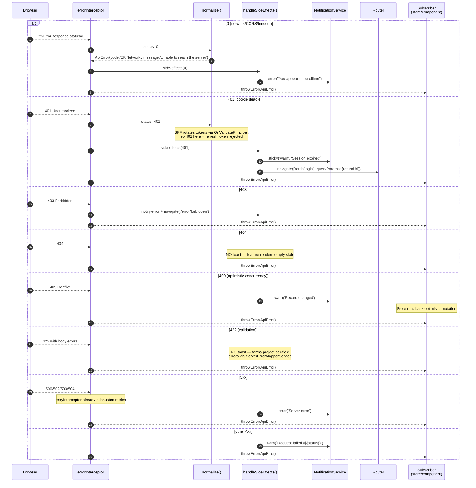
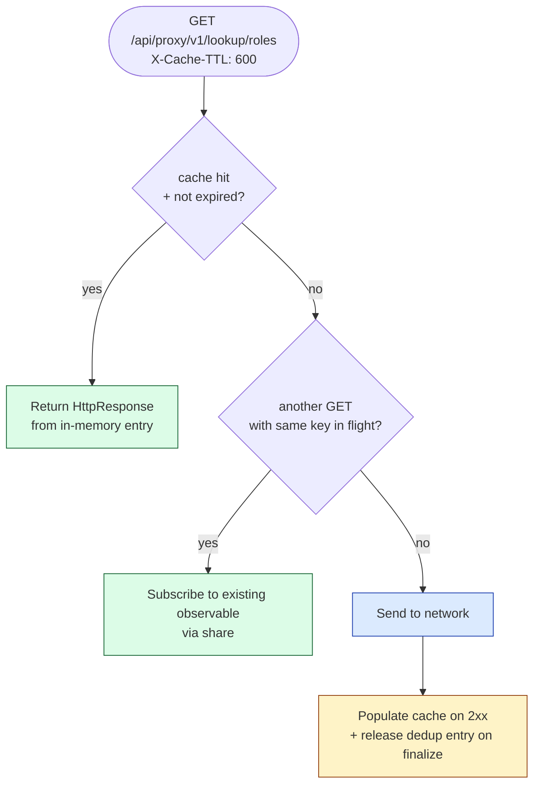

# 03 — Authenticated Request Flow

> "User clicks a button, the SPA calls `/api/proxy/v1/users`. What happens between click and DTO?"
> 6 diagrams: hero, interceptor chain, the proxy hop, error normalization, the cache + dedup short-circuits, end-to-end timing.

This is the diagram you point at when someone asks "where would I add `X` to the request pipeline?".

---

## 3.1 — Hero diagram: one round-trip, two pipelines

The lifecycle of a single authenticated request — from the click in Angular all the way down to the API and back. There are **two pipelines** the request passes through; both matter.



**The two pipelines, side by side:**

| Stage | Browser-side (HttpClient) | Server-side (BFF) |
|---|---|---|
| 1 | `correlationInterceptor` mints `X-Correlation-ID` | `CorrelationIdMiddleware` echoes it on response |
| 2 | `securityInterceptor` sets `X-XSRF-TOKEN` | `SecurityHeadersMiddleware` adds CSP, HSTS, frame-options |
| 3 | `cacheInterceptor` short-circuits if hit | (none) |
| 4 | `dedupInterceptor` joins in-flight | (none) |
| 5 | `loadingInterceptor` increments counter | (none) |
| 6 | `loggingInterceptor` logs request | (none) |
| 7 | `retryInterceptor` (5xx, safe verbs) | (none — retries happen at the SPA, not the BFF) |
| 8 | `errorInterceptor` normalizes + UX | `[Authorize]` → cookie auth → `[AutoValidateAntiforgeryToken]` → `ProxyController` → bearer attach → forward |

**Symmetry to know:** the SPA owns *resilience and UX* (retry, loading, error toasts). The BFF owns *trust and identity* (auth, antiforgery, token swap). Adding a new concern? It belongs in the layer that already cares about that responsibility — never both.

---

## 3.2 — The 8 interceptors, drawn

The functional-interceptor chain wired in `app.config.ts:132-141`. Order matters — each interceptor's docstring calls out *why* it sits where it sits.

```mermaid
flowchart LR
  classDef pre   fill:#dbeafe,stroke:#1e40af,color:#1e3a8a;
  classDef shape fill:#fef3c7,stroke:#92400e;
  classDef cache fill:#dcfce7,stroke:#166534;
  classDef obs   fill:#fae8ff,stroke:#86198f;
  classDef post  fill:#fee2e2,stroke:#991b1b;

  Req((HttpClient.get/.post))

  I1[1 correlationInterceptor<br/>+ X-Correlation-ID<br/>push CorrelationContext]:::pre
  I2[2 securityInterceptor<br/>/api/* only:<br/>+ X-XSRF-TOKEN, X-Requested-With,<br/>X-Content-Type-Options]:::shape
  I3[3 cacheInterceptor<br/>GET + X-Cache-TTL opt-in<br/>200-cap LRU]:::cache
  I4[4 dedupInterceptor<br/>GET single-flight<br/>same key as cache]:::cache
  I5[5 loadingInterceptor<br/>LoadingService.inc/dec<br/>X-Skip-Loading opt-out]:::obs
  I6[6 loggingInterceptor<br/>http.request / http.response]:::obs
  I7[7 retryInterceptor<br/>5xx + GET/HEAD/OPTIONS<br/>exp backoff ±25% jitter]:::post
  I8[8 errorInterceptor<br/>normalize → ApiError<br/>toast + nav side-effects]:::post

  Net((→ Network))
  Resp((← Network))

  Req --> I1 --> I2 --> I3 --> I4 --> I5 --> I6 --> I7 --> I8 --> Net
  Net --> Resp --> I8 -.error.-> I7
  Resp --> I7 --> I6 --> I5 --> I4 --> I3 --> I2 --> I1
```



**Why this order — the load-bearing reasons:**

| # | Interceptor | Why it sits *here* |
|---|---|---|
| 1 | correlation | Stamp the id BEFORE anything else might log |
| 2 | security | XSRF header must be set BEFORE cache key is computed (Accept matters too) |
| 3 | cache | Cache hit short-circuits dedup, loading, logging, retry, error — pure local return |
| 4 | dedup | Joins an in-flight; reuses the same observable so loading counter increments only once |
| 5 | loading | Wraps everything network-bound, including retries (so the spinner shows for the *full* user-perceived duration) |
| 6 | logging | After loading wraps, so log line's `durationMs` matches what the user saw |
| 7 | retry | Below logging so each attempt is visible; above error so a successful retry never reaches `errorInterceptor` |
| 8 | error | Bottom — by the time we're here, retry has exhausted, every network attempt has failed |

**Opt-out headers** — these never reach the server (each interceptor strips its own):

| Header | Effect | Used by |
|---|---|---|
| `X-Cache-TTL: <seconds>` | Opt-IN to cache (default off) | Lookup-list APIs |
| `X-Skip-Cache: true` | Bypass cache, refresh entry | After-mutation reads |
| `X-Skip-Dedup: true` | Bypass dedup | Polling endpoints |
| `X-Skip-Loading: true` | Don't move global progress bar | Background heartbeat |
| `X-Skip-Retry: true` | First failure surfaces immediately | Streaming endpoints |
| `X-Skip-Error-Handling: true` | Don't toast/navigate; raw error to caller | Custom error UX |

A sample usage tells the whole story:

```ts
// Cache the role list for 10 minutes; show inline spinner instead of the global bar.
this.http.get('/api/proxy/v1/lookup/roles', {
  headers: { 'X-Cache-TTL': '600', 'X-Skip-Loading': 'true' },
});
```

---

## 3.3 — The proxy hop, drawn

What `ProxyController.Forward` actually does, line-by-line, with the load-bearing decisions called out.

```mermaid
flowchart TB
  classDef in     fill:#dbeafe,stroke:#1e40af;
  classDef check  fill:#fef3c7,stroke:#92400e;
  classDef build  fill:#dcfce7,stroke:#166534;
  classDef out    fill:#fae8ff,stroke:#86198f;
  classDef err    fill:#fee2e2,stroke:#991b1b;

  A([SPA: GET /api/proxy/v1/users<br/>+ Cookie + X-XSRF-TOKEN]):::in

  B[/ASP.NET routing<br/>matches /api/proxy/{**path}/]:::in
  C[Auth middleware:<br/>cookie → ClaimsPrincipal<br/>OnValidatePrincipal → TokenRefreshService]:::check
  D[ProxyController action attributes:<br/>[Authorize] + [AutoValidateAntiforgeryToken]<br/>verifies XSRF cookie==header]:::check
  E[ProxySettings.ApiBaseUri<br/>+ downstreamPath = target Uri]:::build
  F[Build HttpRequestMessage:<br/>copy non-hop-by-hop headers]:::build
  G[GetTokenAsync('access_token')<br/>→ Authorization: Bearer ...]:::build
  H[client.SendAsync<br/>HttpCompletionOption.ResponseHeadersRead]:::out
  I[Stream response body to client<br/>copy status + non-hop headers]:::out
  J[LogHop method, path, status, ms, sub]:::out

  X1[/Bad URI?<br/>BadRequest 400/]:::err
  X2[/HttpRequestException /<br/>TaskCanceledException?<br/>502 BadGateway/]:::err
  X3[/CopyToAsync throws<br/>after status committed?<br/>log + rethrow → 500/]:::err

  A --> B --> C --> D --> E
  E -- invalid --> X1
  E -- valid --> F --> G --> H
  H -- network err --> X2
  H -- 2xx/4xx/5xx from API --> I
  I -- copy err --> X3
  I --> J
  J --> Z([Response back to SPA]):::out
```

**Decisions worth flagging in the demo:**

1. **`HttpCompletionOption.ResponseHeadersRead`** — start streaming the response body to the client as soon as headers arrive. Don't buffer in BFF memory. Big-list endpoints (10MB JSON) cost the BFF nothing.

2. **Hop-by-hop header strip** — `Connection`, `Keep-Alive`, `Transfer-Encoding`, `Upgrade`, `Host`, `Content-Length`, `Content-Type` are NEVER copied. RFC 7230 §6.1 forbids forwarding them. We also strip `Content-Length` after copy to avoid the duplicate-length-header bug.

3. **Bearer attach is conditional** — `if (opts.AttachBearerToken)`. Set it to `false` and the proxy still forwards (useful for downstream APIs that auth on cookies passed through, or for unauthenticated downstreams like a public catalog).

4. **`[AutoValidateAntiforgeryToken]` skips safe verbs** by spec — GET/HEAD/OPTIONS/TRACE pass through without XSRF check. POST/PUT/PATCH/DELETE require the header to match. So a malicious site can read public GETs but not mutate.

5. **502 vs 500** — when the BFF can't *reach* the API (network/timeout), the SPA gets 502. When the API itself returns 500, the SPA gets that 500 verbatim. The two cases need different ops responses; 502 means "downstream is down", 500 means "downstream had a bug".

6. **Correlation propagation** — the BFF's `CorrelationIdMiddleware` populates `X-Correlation-ID` on the *response*. The proxy then stamps that header explicitly on the outbound request to the API (lines 117-122). Net effect: a single id flows browser → BFF logs → API logs → DB query tag.

### Tradeoff: hand-rolled vs YARP

| Aspect | Hand-rolled `ProxyController` (current) | YARP |
|---|---|---|
| LoC | ~200 lines | ~50 lines + config |
| Auth swap | Explicit `GetTokenAsync` + `Authorization` header set | Transform extension |
| Custom logging | Source-generated `LogHop` per request | Built-in metrics + custom events |
| Streaming | Already handled (`ResponseHeadersRead`) | Already handled |
| Per-route policy | Add an `if (downstreamPath.StartsWith(...))` block | Config-driven |
| Test surface | Standard MVC controller tests | YARP transform tests |

We use the hand-rolled version while the foundation is forming because the auth swap is *the* trickiest part of the BFF and we want it readable. When the route count grows past ~5 and per-route policies (rate limit by route, transform by route) start mattering, we'll swap to YARP. The `ProxyController` XML doc says exactly that.

---

## 3.4 — Error normalization, drawn

What happens when something goes wrong. The SPA's `errorInterceptor` is the single funnel — every store, every component, every guard sees the same `ApiError` shape regardless of how the failure happened.



**The single rule that keeps this clean: *interceptors own toasts, stores own inline errors*.**

A common pre-rule bug:
- Store catches HTTP error, calls `notify.error(...)`.
- `errorInterceptor` *also* calls `notify.error(...)`.
- User sees two toasts for one failure.

The rule's enforcement: every store's catch handler captures the normalized `ApiError` into a local `error()` signal for inline rendering, and re-throws or returns silently. Stores never call `notify.*` on HTTP failures.

**The normalized `ApiError` shape:**

```ts
interface ApiError {
  message: string;
  statusCode: number;
  code?: string;            // 'EP.Network' | 'EP.UserNotFound' | ...
  errors?: Record<string, string[]>;  // RFC 7807 per-field validation
  correlationId?: string;
  timestamp: string;
}
```

Sources it accepts (the `normalize()` fn at `error.interceptor.ts:96`):
- RFC 7807 `application/problem+json` — `title`, `detail`, `type`, `errors`
- Legacy `{ message, code }` envelope
- Browser-level `HttpErrorResponse` with `status: 0` (network)
- Plain string error bodies (best-effort)

---

## 3.5 — Cache + dedup short-circuits

Most of the time, the network is the slowest part. Cache and dedup both elide the network — but for different reasons.



**When does *which* fire?**

- **Two near-simultaneous calls** to the same lookup endpoint at app startup → first goes to network, second joins via dedup. Network trips: 1.
- **Same lookup polled every 30s with `X-Cache-TTL: 60`** → first call populates cache. Second call (30s later) is a cache hit. Network trips: 1 per 60s.
- **Mutation followed by re-read** with `X-Skip-Cache: true` → forces network, refreshes cache entry. Network trips: 1.
- **No headers set** → cache passes through (TTL 0 = opt-in only); dedup still applies. Bug-free default.

**Why `X-Cache-TTL` is opt-in and not opt-out:** caching by default would mask staleness bugs in features that don't think about it. Opt-in means every cached endpoint is a deliberate decision — and shows up in `git grep "X-Cache-TTL"` for review.

---

## 3.6 — End-to-end timing budget

A useful framing for the demo. "Where does the time go?"

```mermaid
gantt
  title  One authenticated GET, fast path
  dateFormat  X
  axisFormat  %s

  section SPA
  HttpClient.get → interceptor chain   :a1, 0, 1
  network out                           :a2, after a1, 5
  network in                            :a3, after b3, 5
  decode + store + render               :a4, after a3, 4

  section BFF (Web.UI)
  middleware (security, corr, cors, ratelimit) :b1, after a2, 2
  cookie auth + TokenRefresh skip      :b2, after b1, 2
  proxy build + GetTokenAsync          :b3, after b2, 2

  section API
  receive + auth bearer                :c1, after b3, 3
  MediatR + EF + DB                    :c2, after c1, 30
  serialize                            :c3, after c2, 2
```



**Reality check (typical numbers from staging):**

| Stage | p50 | p99 | Notes |
|---|---|---|---|
| SPA HttpClient → fetch | <1 ms | <3 ms | All synchronous |
| Browser ↔ BFF (LAN) | 5–15 ms | 50 ms | TCP+TLS reuse via HTTP/2 |
| BFF middleware | 1–2 ms | 8 ms | Auth check is cookie decryption + claim materialization |
| BFF `OnValidatePrincipal` skip | <1 ms | 50 ms | <1ms on skip; ~50ms when refresh fires (Entra round-trip) |
| BFF → API hop | 3–10 ms | 30 ms | Same VNet |
| API handler + DB | 20–200 ms | 800 ms | Where 95%+ of latency lives |
| Total user-perceived | ~50 ms | ~900 ms | Cache hits drop to <10 ms |

**Optimization order** — this is what you tell engineers when they ask "how do I make this faster":
1. Add `X-Cache-TTL` if the data tolerates staleness — biggest single win
2. Verify N+1 isn't lurking in the API handler (out of scope for this deck)
3. Add response compression at the LB (out of scope)
4. *Then* fiddle with interceptor order / SPA code splitting

The pipeline is rarely the bottleneck — the API handler is.

---

## 3.7 — Demo script (talking points)

1. **Open §3.1 hero.** The two pipelines, side by side. "Browser owns UX, server owns trust."
2. **Drill into §3.2** when someone asks "where do I add `X`?" Pull up the table and find the layer that already cares. New retry logic? Replace the retry interceptor — don't add a 9th. New telemetry? It's `loggingInterceptor`'s job.
3. **Drill into §3.3** when someone asks "why a custom proxy and not just routing?" Show the `[AutoValidateAntiforgeryToken]` line and the `GetTokenAsync` line — those are the two reasons. YARP can do both, but reading 200 LoC of clear code is faster than reading config + understanding YARP transforms.
4. **Drill into §3.4** when someone asks about error UX. The `interceptors-own-toasts` rule is the single thing that keeps double-toasting away.
5. **Drill into §3.5** for the "but isn't this all hitting the network constantly?" question.

| Q | A |
|---|---|
| "Where would I add request signing (HMAC)?" | New interceptor between security (#2) and cache (#3); BFF would need a verifier at the edge |
| "Why isn't there an auth-token interceptor in the SPA?" | Tokens never leave the BFF — see §1.3 trust boundary |
| "Can I add a feature-specific cache strategy?" | Yes — set `X-Cache-TTL` per call, or wrap a `BaseApiService` with a different default |
| "What if the API returns 401 mid-session?" | `errorInterceptor` redirects to `/auth/login` with `returnUrl` — fresh OIDC starts |
| "How do I trace one user's session in logs?" | Pivot on `X-Correlation-ID` (browser → BFF → API) or `sub` claim (BFF logs); both are stamped automatically |
| "Why isn't there a retry on the BFF too?" | Retries belong at the layer closest to the user — the SPA. Adding a second retry layer multiplies attempts and confuses error handling. |
| "What about gRPC / SignalR / WebSockets?" | Out of scope this deck. SignalR uses a different connection lifecycle; the cookie still authenticates it. |

---

Continue to **[04 — Token Refresh + Logout](./04-Flow-Token-Refresh-And-Logout.md)** for the long-running session story.
