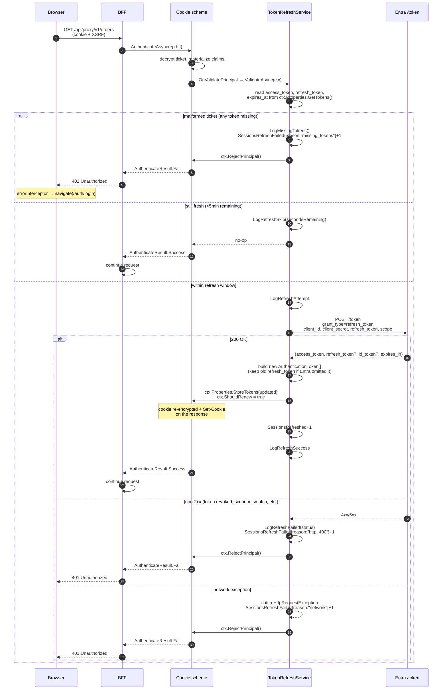
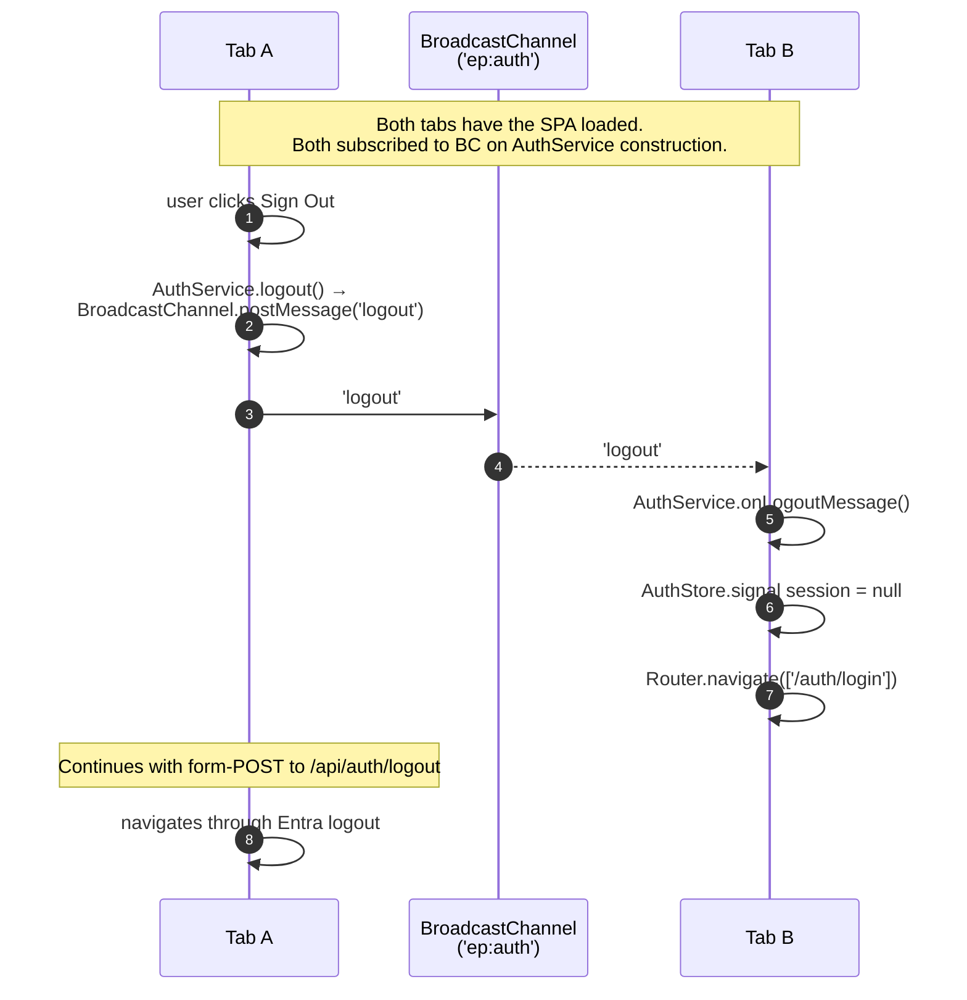
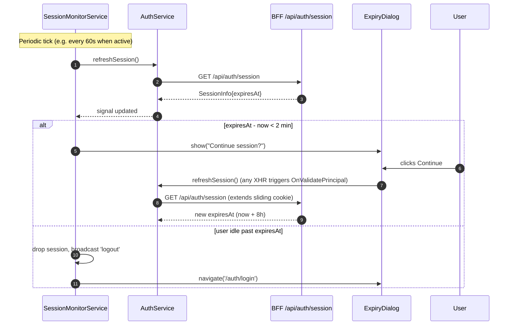

# 04 — Token Refresh + Logout

> "Sessions live for hours; access tokens die in 60 minutes. How do we bridge the gap without flickering, double prompts, or stranded tabs?"
> 4 diagrams: refresh-on-validate, the failure modes, single sign-out, cross-tab logout.

---

## 4.1 — The session lifecycle, drawn

Three timescales matter, and they don't line up:

```mermaid
gantt
  title Session timescales (typical)
  dateFormat HH:mm
  axisFormat %H:%M

  section Cookie ticket (sliding 8h)
  ep.bff.session valid              :crit, c1, 09:00, 480m

  section Access token (Entra issued)
  Token #1 (60m)                    :active, t1, 09:00, 60m
  Token #2 (60m)                    :active, t2, after t1, 60m
  Token #3 (60m)                    :active, t3, after t2, 60m

  section Refresh windows (last 5min of each token)
  Refresh #1                        :milestone, r1, 09:55, 0
  Refresh #2                        :milestone, r2, 10:55, 0
  Refresh #3                        :milestone, r3, 11:55, 0
```



- **Cookie ticket lifetime:** sliding 8h (`AzureAdSettings.SessionLifetime`, applied by `options.SlidingExpiration = true; options.ExpireTimeSpan = ...`). Active use keeps it alive; idle for 8h ends the session.
- **Access token lifetime:** ~60 minutes (Entra default). Embedded inside the cookie ticket via `SaveTokens=true`.
- **Refresh window:** last 5 minutes of access-token life (`TokenRefreshService.RefreshThreshold`). Outside the window, refresh skips. Inside, it fires once per request.

The refresh hook runs on **every** authenticated request (`OnValidatePrincipal`) but does work only inside the window. Net cost: a few microseconds per request, plus one Entra round-trip every ~55 minutes.

---

## 4.2 — Refresh-on-validate, in detail



**The four observability signals you watch:**

| Counter | What it means |
|---|---|
| `SessionsCreated` | New cookie issued — incremented in `OnSigningIn` |
| `SessionsRefreshed` | Successful refresh round-trip |
| `SessionsRefreshFailed{reason}` | Refresh failed — labelled `missing_tokens`, `network`, `http_<code>`, `deserialize`, `empty_payload` |
| `SessionLifetimeSeconds{reason}` | Histogram on sign-out — `signout` for explicit logout |

A sustained spike in `SessionsRefreshFailed{reason="network"}` means Entra is unreachable from the BFF (DNS, NSG, outage). A spike in `http_401` or `http_403` means a refresh token was revoked en masse (admin action, breach response).

**Why we *don't* do background timer-based refresh:**
- A timer wakes up the process even when no user activity exists. The hook approach does work *only* on a real user request — refresh is naturally amortized to active sessions.
- Multi-pod hosts would each run their own timer, hammering Entra N× per refresh. The hook approach refreshes per-request, regardless of pod.
- Clock drift becomes unimportant — the 5-minute threshold is generous enough that a ±30s drift is invisible.

**Why a *generous* 5-min threshold:**
- A request that arrives at minute 59 with `expires_at = 60min` would have ~30s of token life left after the BFF auth check, plus the Entra refresh round-trip itself (~50ms), plus the proxy hop, plus API processing. If the API is slow (~2s), the bearer might hit Entra's resource server *after* the token expired. 5 minutes covers any realistic latency.

---

## 4.3 — Refresh failure modes, summarized

A demo-friendly cheat sheet of "what went wrong and what the user sees":

| Failure | Symptom (user) | Symptom (logs) | Recovery path |
|---|---|---|---|
| Cookie ticket malformed (downgrade, key rotation without ring) | 401 on first XHR | `Token.Refresh.MissingStashedTokens` | SPA redirects to `/auth/login`, fresh OIDC flow |
| Access token expired but refresh *still works* | Nothing — refresh succeeds silently | `Token.Refresh.Success` | Transparent |
| Refresh token revoked at Entra (admin action) | 401, sticky toast "Session expired" | `Token.Refresh.Failed status=400` | Fresh OIDC flow; user signs in again |
| Network blip to Entra | 401 (current behavior — `RejectPrincipal` on `HttpRequestException`) | `Token.Refresh.Exception` | Fresh OIDC flow |
| Cookie *signed* with a key the deserializing pod doesn't have | Silent sign-out — looks like idle expiry | (no log; auth stack drops the ticket) | Share the data-protection key ring (§1.2) |
| User has the tab open all night past `SessionLifetime` | First action after expiry → 401 | `Token.Refresh.MissingStashedTokens` (cookie absent) | Fresh OIDC flow |

**One sharp edge** worth flagging: **a transient Entra hiccup currently kicks the user out**. The fail policy `RejectPrincipal()` on network exception is conservative — if Entra blinks, the user re-logs in. A future hardening (Polly + retry on the named HTTP client, mentioned in §2.5) would absorb the blip.

---

## 4.4 — Logout (single sign-out)

Logout is a top-level POST that triggers a *cascade* of redirects: clear the cookie locally, redirect to Entra to terminate the IdP session, redirect back to the BFF, redirect to the SPA landing page.

```mermaid
sequenceDiagram
  autonumber
  participant U as User
  participant B as Browser
  participant H as BFF
  participant AC as AuthController
  participant CK as Cookie scheme
  participant Oidc as OIDC scheme
  participant E as Entra /logout

  U->>B: clicks "Sign out" (form POST,<br/>NOT XHR — same reason as login)
  B->>H: POST /api/auth/logout?returnUrl=/

  H->>AC: Logout(returnUrl)
  AC->>AC: SanitizeReturnUrl<br/>(IsLocalUrl or fallback to /)

  alt already anonymous
    AC->>AC: LogLogoutAlreadyAnonymous
    AC-->>B: 302 → /
  else authenticated
    AC->>AC: LogLogoutSignOut
    AC->>CK: SignOut(props, CookieScheme, OidcScheme)
    CK->>CK: OnSigningOut event<br/>SessionLifetimeSeconds.Record(seconds, reason="signout")
    CK->>CK: clear cookie (Set-Cookie ep.bff.session=; Max-Age=0)
    CK->>Oidc: forward to OIDC sign-out
    Oidc->>Oidc: OnRedirectToIdentityProviderForSignOut<br/>read id_token from ticket → IdTokenHint
    Oidc-->>B: 302 Location: login.microsoftonline.com/.../logout?<br/>id_token_hint=...&post_logout_redirect_uri=https://app/signout-callback-oidc
  end

  B->>E: GET /logout (top-level)
  E->>E: terminate Entra session<br/>(no account-picker thanks to id_token_hint)
  E-->>B: 302 Location: https://app/signout-callback-oidc
  B->>H: GET /signout-callback-oidc
  H->>Oidc: handle callback (no-op now)
  Oidc-->>B: 302 Location: <returnUrl>  (originally / )
  B->>H: GET /
  H-->>B: 200 index.html (anonymous)
  B->>H: GET /api/auth/session
  H-->>B: 200 SessionInfo.Anonymous
  B->>B: Router → /auth/login (guard kicks)
```

**Three things worth pointing out:**

1. **`POST /api/auth/logout`** — not GET. Why: link previewers, prefetchers, and accidental refreshes cannot trigger it. The SPA submits a form (not an XHR) so the browser follows redirects natively.

2. **`id_token_hint` matters.** Without it, Entra would show the user an "account picker" screen ("Sign out of which account?") even when only one is logged in. With the hint, Entra knows which session to terminate and goes straight to the redirect — single click, single redirect chain, no extra UI.

3. **Both schemes signed out, in order.** `SignOut(props, CookieScheme, OidcScheme)` clears the local cookie *first*, then chains to OIDC end-session. If the OIDC handler ever throws, the cookie is still gone — the user's BFF session is dead even if Entra's isn't. (Hardening idea: a fallback "force-clear cookie + show local goodbye page" for the rare case where Entra is unreachable during sign-out.)

### Tradeoff: front-channel vs back-channel logout

| Aspect | Front-channel (current — browser drives redirects) | Back-channel (server-to-server logout notifications) |
|---|---|---|
| Setup cost | Built into `AddOpenIdConnect` | Needs Entra app config + endpoint registration |
| Multi-tab single sign-out | Need cross-tab broadcast (§4.5) | Free — Entra notifies every tracked session |
| Failure mode | If user kills tab mid-redirect, BFF cookie is gone but Entra session lives | Entra retries the back-channel call |
| Demo'able? | Yes, in a live demo | Requires staging Entra config |

We use front-channel + cross-tab broadcast (next section) because the BFF is single-region and back-channel adds complexity for marginal benefit. When we add a second region, back-channel becomes worthwhile.

---

## 4.5 — Cross-tab logout (BroadcastChannel)

If the user has Tab A and Tab B both open and signs out in Tab A, Tab B is now zombie — its in-memory `AuthService` still thinks it's signed in until the next XHR returns 401. We close the gap with `BroadcastChannel`.



**Constants** (from `auth.service.ts:53-54`):
- Channel name: `'ep:auth'`
- Message: `'logout'`

The same channel could carry a future `'login'` message to refresh `AuthStore` cross-tab, but we don't need that today (the next page load each tab does already triggers `/api/auth/session`).

**Why BroadcastChannel, not localStorage events:** localStorage cross-tab signalling works but requires writing then deleting a key — race-prone. BroadcastChannel is purpose-built, has ~98% browser support (everything except old Safari), and the API is `postMessage`/`onmessage`. The `BroadcastChannel('ep:auth')` is opened in `AuthService` constructor and torn down in `destroyRef.onDestroy`.

---

## 4.6 — Session expiry warning (planned)

Not yet shipped, but architecturally drawn so it's clear where it slots in:



The `SessionMonitorService` already exists — the dialog UX is the missing piece, which the AuthStore design is ready for.

---

## 4.7 — Demo script (talking points)

1. **Open §4.1 timescales chart.** "Three timescales, none aligned. The refresh hook bridges the gap."
2. **Drill into §4.2** when someone asks "why every request, isn't that expensive?" Walk through the skip-fast path (3 lines, no I/O) vs the in-window path. Cite p99 of 50ms in §3.6.
3. **Drill into §4.3** for "what about all the things that can go wrong?" Wave the table.
4. **Drill into §4.4** when someone asks about logout. Two reasons it's a POST, three reasons `id_token_hint` matters, one reason both schemes sign out together.
5. **Drill into §4.5** for the multi-tab question.

| Q | A |
|---|---|
| "What happens during a deploy that rotates cookie keys?" | Sessions silently die unless Key Vault key ring is shared. §1.2 explains why we ship that. |
| "Can I make refresh asynchronous (not blocking the request)?" | No — the request needs the fresh token to attach to the proxy hop. Async refresh would require a token cache + double-write fence. Out of scope; not worth it for ~50ms. |
| "What if Entra is down?" | Currently: any session in the refresh window kicks back to login. Future: Polly-retry the named HTTP client. |
| "How do I force a user out (e.g. revoking access)?" | Revoke their refresh token at Entra; their next request fails refresh and they re-auth. There's no "kill switch" in the BFF itself. |
| "Why not just store tokens in Redis?" | Cookie tickets are stateless across pods (with shared key ring) — no Redis dependency, no extra hop. Redis would be a regression. |
| "Idle timeout vs absolute timeout?" | Sliding (idle) only, set by `SessionLifetime`. Absolute timeout is enforced by the *refresh token's* family lifetime at Entra (90 days default). Layered defense. |

---

Continue to **05 — Web.UI Internals** *(next)* — the BFF's full pipeline + DI fan-out + named HTTP clients + Setup/* extension methods.
