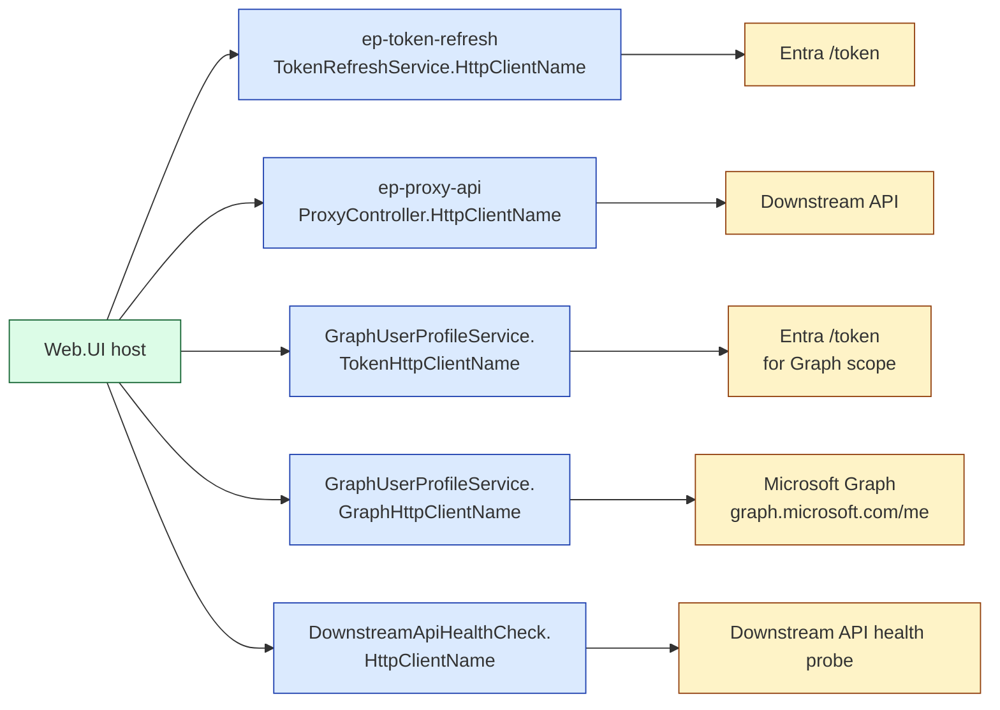
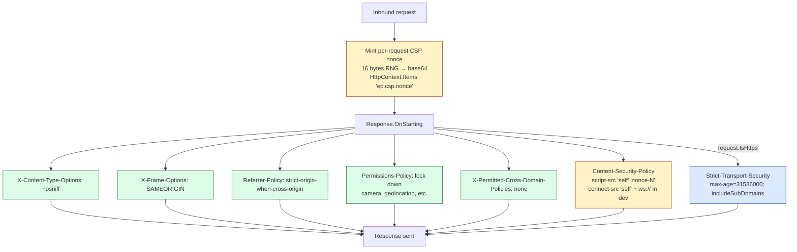
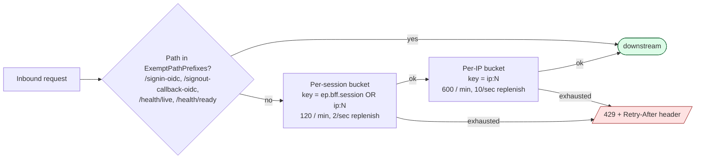

# 05 — Web.UI Internals

> The BFF host, opened up. Folder by folder, what runs when, and why each file exists.
> 5 diagrams: composition root, pipeline order revisited, named HTTP clients, security headers, rate limiter, health checks.

This doc is for someone who's about to add a feature to the BFF and needs to know *exactly* where it goes.

---

## 5.1 — Composition root: `Program.cs`

The whole BFF in one screenful — what `Program.cs` does, top to bottom.

```mermaid
flowchart TB
  classDef boot   fill:#e0f2fe,stroke:#0369a1;
  classDef bind   fill:#fef9c3,stroke:#a16207;
  classDef setup  fill:#dcfce7,stroke:#166534;
  classDef build  fill:#fae8ff,stroke:#86198f;
  classDef run    fill:#dbeafe,stroke:#1e40af;

  A[Bootstrap Serilog<br/>StructuredLoggingSetup<br/>CreateBootstrapLogger]:::boot
  B[builder = WebApplication.CreateBuilder<br/>Configuration: appsettings + env]:::boot
  C[builder.Host.UseSerilog<br/>swap bootstrap → real logger]:::boot

  D1[AddOptions Cors / Proxy / SpaHosting]:::bind

  E1[AddPlatformAuthentication<br/>Cookie + OIDC schemes]:::setup
  E2[AddPlatformCors<br/>policy = ep-web-ui]:::setup
  E3[AddPlatformHealthChecks<br/>self + downstream-api]:::setup
  E4[AddPlatformRateLimiter<br/>per-session + per-IP buckets]:::setup
  E5[AddPlatformAntiforgery<br/>XSRF cookie + header]:::setup

  F1[AddMemoryCache<br/>backing the GraphProfile cache]:::setup
  F2[AddHttpClient TokenHttpClient<br/>+ GraphHttpClient]:::setup
  F3[AddHttpClient ProxyController<br/>ep-proxy-api]:::setup
  F4[AddScoped GraphUserProfileService]:::setup
  F5[AddControllersWithViews<br/>required for AutoValidateAntiforgery filter]:::setup

  G[var app = builder.Build()]:::build

  P1[UseSecurityHeaders]:::run
  P2[UseCorrelationId]:::run
  P3[UseDeveloperExceptionPage / UseExceptionHandler]:::run
  P4[UseHsts + UseHttpsRedirection — prod only]:::run
  P5[UseStaticFiles — SPA bundle]:::run
  P6[UseRouting]:::run
  P7[UseCors]:::run
  P8[UseRateLimiter]:::run
  P9[UseAuthentication]:::run
  P10[UseAuthorization]:::run
  P11[MapHealthEndpoints anonymous]:::run
  P12[MapControllers]:::run
  P13[MapSpaFallback — LAST]:::run
  P14[app.RunAsync]:::run

  A --> B --> C --> D1 --> E1 --> E2 --> E3 --> E4 --> E5 --> F1 --> F2 --> F3 --> F4 --> F5 --> G --> P1 --> P2 --> P3 --> P4 --> P5 --> P6 --> P7 --> P8 --> P9 --> P10 --> P11 --> P12 --> P13 --> P14
```

**The shape of `Program.cs`** — three monotone phases:
1. **Configure logging** (lines 14–37). Bootstrap logger first so any failure during DI registration still emits a structured log.
2. **Register services** (lines 40–68). Settings binding → Platform setup extensions → named HTTP clients → MVC.
3. **Build pipeline** (lines 70–157). Middleware order is hard-coded by physics; every line has a comment explaining its position.

**Adding a new concern** — three-step recipe:
1. New file `Setup/PlatformX.cs` with `public static IServiceCollection AddPlatformX(this IServiceCollection, IConfiguration?)`.
2. One line in `Program.cs` services section: `builder.Services.AddPlatformX(builder.Configuration);`.
3. If pipeline middleware: one line in pipeline section, in the right slot.

The convention: never put more than 1–2 lines of DI logic directly in `Program.cs`. Everything else is in `Setup/Platform*.cs`. (Canonical: `Docs/Architecture/API-Program-cs-Reference.md`.)

---

## 5.2 — Folder map (current)

```
src/UI/Enterprise.Platform.Web.UI/
├── Program.cs                  ← composition root (~170 LoC)
├── appsettings.json            ← non-secret defaults
├── appsettings.Development.json
│
├── Setup/                      ← service registrations
│   ├── PlatformAuthenticationSetup.cs    Cookie + OIDC + token refresh
│   ├── PlatformCorsSetup.cs              "ep-web-ui" policy
│   ├── PlatformAntiforgerySetup.cs       __RequestVerificationToken cookie
│   ├── PlatformRateLimiterSetup.cs       per-session + per-IP token buckets
│   └── PlatformHealthCheckSetup.cs       self + downstream-api
│
├── Middleware/                 ← per-request pipeline pieces
│   ├── SecurityHeadersMiddleware.cs      CSP, HSTS, X-Frame, Permissions
│   └── CorrelationIdMiddleware.cs        X-Correlation-ID + Serilog scope
│
├── Endpoints/                  ← MapXxx() helpers — minimal-API surface
│   ├── HealthEndpoints.cs                /health/live, /health/ready
│   └── SpaFallbackEndpoint.cs            * → index.html
│
├── Controllers/                ← request handlers (controller-based)
│   ├── AuthController.cs                 /api/auth/{login,logout,session,me/profile,me/permissions}
│   ├── ProxyController.cs                /api/proxy/{**path}
│   ├── AntiForgeryController.cs          /api/antiforgery/token
│   └── Models/                           Request/response DTOs
│
├── Services/                   ← application services (DI'd into controllers)
│   ├── Authentication/
│   │   └── TokenRefreshService.cs        OnValidatePrincipal hook implementation
│   ├── Graph/
│   │   └── GraphUserProfileService.cs    /me + photo, IMemoryCache-backed
│   └── HealthChecks/
│       └── DownstreamApiHealthCheck.cs   readiness probe
│
├── Configuration/              ← strongly-typed settings + DTOs
│   ├── ProxySettings.cs                  ApiBaseUri, AttachBearerToken, Timeout
│   ├── SpaHostingSettings.cs             StaticRoot
│   └── AzureAdSettings.cs                Tenant/Client/Secret, ApiScope, callbacks
│
├── Observability/
│   └── SessionMetrics.cs                 OpenTelemetry Meter + 4 instruments
│
└── ClientApp/                  ← the Angular app
    └── (its own deck — see 06–09)
```

**Convention by folder name:**

| Folder | Reads as | Contents |
|---|---|---|
| `Setup/` | "what services + options to register" | `Add*` extension methods on `IServiceCollection` |
| `Middleware/` | "what runs per-request, before routing" | `Use*` extension methods on `IApplicationBuilder` |
| `Endpoints/` | "what minimal-API maps to register" | `Map*` extension methods on `IEndpointRouteBuilder` |
| `Controllers/` | "MVC controllers" | Classes ending in `Controller` |
| `Services/` | "DI-injected logic with a private interface" | Sealed classes; injected via constructor |
| `Configuration/` | "options classes" | Records + `[OptionsValidator]` partial classes |
| `Observability/` | "metrics, traces, logs" | `Meter`, `ActivitySource` owners |

This convention isn't enforced by an analyzer — it's enforced by code review. Worth keeping anyway because it makes a 30-second tour of the project obvious to a newcomer.

---

## 5.3 — Named HTTP clients

There are **four** named `HttpClient` instances. Each has a different purpose, lifetime, and policy. Using them by name keeps DI clean.



**Why split into separate names** instead of one shared client:

| Concern | Per-client knob |
|---|---|
| Timeout | `ProxyController` reads `ProxySettings.Timeout`; `TokenRefresh` is implicit (RequestAborted-bound) |
| Retry policy | Polly handlers attach per-name (planned hardening) |
| User-agent | Distinct `User-Agent` per client = distinguishable in upstream logs |
| Rate-limit handler | Per-client back-off for 429s |
| Dispose lifetime | All managed by `IHttpClientFactory` — no manual `using` |

**Don't do this:** `new HttpClient()` anywhere outside the factory. Direct instantiation leaks sockets and bypasses the factory's connection pool. The convention: every HTTP call goes through `IHttpClientFactory.CreateClient(NamedClient.Name)`.

---

## 5.4 — Security headers, drawn

`SecurityHeadersMiddleware` runs **first** in the pipeline. Every response (success, error, redirect) leaves with these headers.



**The CSP, broken down:**

| Directive | Value (prod) | Why |
|---|---|---|
| `default-src` | `'self'` | Anything not otherwise specified comes from us only |
| `script-src` | `'self' 'nonce-{N}'` | Bundle is `<script src=...>` so it matches `'self'`; nonce is reserved for future inline use |
| `style-src` | `'self' 'unsafe-inline' https://fonts.googleapis.com` | PrimeNG injects runtime `<style>` nodes; future migration is "PrimeNG CSP nonce mode" |
| `img-src` | `'self' data: https:` | `data:` for inline avatars, `https:` for any CDN avatar |
| `font-src` | `'self' data: https://fonts.gstatic.com` | Google Fonts WOFF2; toggle off when fonts are self-hosted |
| `connect-src` | `'self'` (prod), `+ ws://localhost:* http://localhost:*` (dev) | All XHR is same-origin. Dev adds the hot-reload WebSocket. |
| `frame-ancestors` | `'self'` | No clickjacking |
| `base-uri` | `'self'` | Prevents `<base href="evil">` injection |
| `form-action` | `'self' https://login.microsoftonline.com` | Logout submits to BFF, then 302s to Entra — both must be allowed |
| `object-src` | `'none'` | No Flash/Java/PDF embeds |

**Two non-obvious decisions:**
- The `form-action` allow-list is the difference between "logout works" and "browser silently blocks the redirect chain to Entra". Memorialized, will not regress.
- The `style-src 'unsafe-inline'` is a known compromise — PrimeNG injects `<style>` nodes at runtime. The hardening path is PrimeNG's CSP nonce mode (`nonce` token in `providePrimeNG`), but that's a separate migration.

---

## 5.5 — Rate limiter, drawn

Two-bucket chained limiter — exhausting either returns `429 Too Many Requests`. OIDC callbacks and health checks are exempt.



**Why this shape:**

- **Per-session bucket** stops a single user from hammering the BFF (e.g. a runaway loop in their tab). 120/min is generous for normal SPA traffic — XHR per page-view is typically <20.
- **Per-IP bucket** stops a single host from creating many sessions and burning through them sequentially. 600/min covers small-team shared-IP cases (e.g. office NAT) without flagging legit traffic.
- **OIDC callback exempt** — a slow Entra round-trip cannot be rate-limited mid-handshake; the user would be stuck.
- **Health checks exempt** — the LB's probe interval (e.g. 1s) would otherwise eat tokens.
- **Token bucket, not fixed window** — burst-tolerant. A user can do 30 calls in 5 seconds (a complex dashboard load) without 429ing as long as they're not sustaining that rate.

**429 response shape** (from `OnRejected`):
```json
{
  "title": "Too many requests",
  "detail": "Edge rate limit exceeded; retry after the time in the Retry-After header."
}
```
With `Retry-After: <seconds>` so clients (including the SPA's `retryInterceptor`) can back off appropriately.

---

## 5.6 — Health checks, drawn

```mermaid
flowchart LR
  classDef live  fill:#dcfce7,stroke:#166534;
  classDef ready fill:#fef9c3,stroke:#a16207;

  LB[Load balancer]
  K8s[K8s kubelet]

  HE[/HealthEndpoints/]
  Live[GET /health/live<br/>tags = liveness]:::live
  Ready[GET /health/ready<br/>tags = readiness]:::ready

  Self[self check<br/>"Web.UI process is up"]
  Down[downstream-api check<br/>HTTP HEAD on ApiBaseUri]

  K8s --> HE --> Live --> Self
  LB --> HE --> Ready --> Down
```

**Two probes, two consumers:**

| Probe | Tag | What it checks | Consumer | Action on fail |
|---|---|---|---|---|
| `/health/live` | `liveness` | Kestrel is serving + this process exists | K8s kubelet | Restart pod |
| `/health/ready` | `readiness` | Downstream API is reachable | Load balancer | Stop sending traffic to this pod |

**The split matters:** if the API tier is down, this BFF pod is *not* broken — restarting it changes nothing. But it shouldn't receive traffic until the API recovers. Tag-based separation lets the LB drain the pod (no traffic) while kubelet leaves it running (no restart).

**JSON response shape:**
```json
{
  "status": "Healthy" | "Degraded" | "Unhealthy",
  "durationMs": 12.4,
  "entries": {
    "self":           { "status": "Healthy",   "durationMs": 0.1, "tags": ["liveness"] },
    "downstream-api": { "status": "Healthy",   "durationMs": 8.2, "tags": ["readiness", "dependency"] }
  }
}
```

---

## 5.7 — SPA fallback, drawn

The last endpoint in the chain. By the time we get here, every other handler has had its shot.

```mermaid
flowchart TB
  classDef ok   fill:#dcfce7,stroke:#166534;
  classDef miss fill:#fef9c3,stroke:#a16207;
  classDef bad  fill:#fee2e2,stroke:#991b1b;

  In[Unmatched route]
  P1{path starts with<br/>/api/, /signin-oidc,<br/>/signout-callback-oidc, /health/?}
  R1[/404 Not Found/]:::bad

  Resolve[ResolveStaticRoot<br/>SpaHostingSettings.StaticRoot OR<br/>WebRootPath fallback]
  P2{index.html exists?}
  R2[/404 + diagnostic message<br/>"Run npm run watch in ClientApp/"/]:::bad
  Send[SendFileAsync index.html<br/>ContentType text/html]:::ok

  In --> P1
  P1 -- yes --> R1
  P1 -- no --> Resolve --> P2
  P2 -- no --> R2
  P2 -- yes --> Send
```

**Two non-obvious decisions:**

1. **`/{**catchAll}` route, NOT the parameterless `MapFallback(handler)`.** The single-arg overload uses `{*path:nonfile}` which excludes any path with a `.` in the last segment — so `/users/123/edit.preview` would silently 404. We use the explicit two-arg overload to catch *every* unmatched path. (Memorialized: `feedback_mapfallback_nonfile_constraint.md`.)

2. **Defense-in-depth path-prefix 404.** Even though API/OIDC/health endpoints would normally claim their requests, the fallback explicitly returns 404 for those prefixes if anything got through. Reason: returning `index.html` for a missing `/api/foo` would cause the SPA's HTTP error handling to receive HTML instead of JSON, leading to a confusing CORS/parse error in the console.

---

## 5.8 — Demo script (talking points)

1. **Open §5.1 composition root.** The whole BFF in one diagram. "Three phases: configure logging → register services → build pipeline."
2. **Drill into §5.2** when someone asks "where would I add `X`?" The folder map is the answer.
3. **Drill into §5.4 CSP** when security questions come up. Walk the directives.
4. **Drill into §5.5 rate limiter** for capacity questions.
5. **Drill into §5.6 health checks** for ops questions.

| Q | A |
|---|---|
| "What if the API is in a different region — does the BFF go there too?" | One BFF region per API region. The proxy hop cost is dominated by API latency, not BFF overhead. |
| "How do I add a new BFF endpoint?" | New controller in `Controllers/`. If it needs auth: `[Authorize]`. If it mutates: `[AutoValidateAntiforgeryToken]` is class-level on inheritors of base. |
| "How do I add a new BFF service (not endpoint)?" | New file in `Services/<concern>/Foo.cs`, `services.AddScoped<Foo>()` in `Program.cs`. |
| "How do I add config?" | New `Configuration/FooSettings.cs` record, `services.AddOptions<FooSettings>().Bind(...)` in `Program.cs`, `appsettings.json` section. |
| "Can I reuse this for a non-Angular SPA?" | Yes — only `MapSpaFallback` is Angular-aware (looks for `index.html`). Replace it for Vue/React. The auth + proxy + headers are framework-neutral. |
| "Why CSP via header instead of meta tag?" | `frame-ancestors` is ignored when emitted via `<meta>`. Header CSP is the only way to set frame-ancestors correctly. |

---

Continue to **06 — Angular App Structure** *(next)* — `config / core / features / layouts / shared`, signal stores, dependency-cruiser rules.
