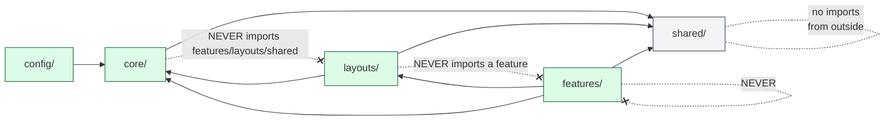
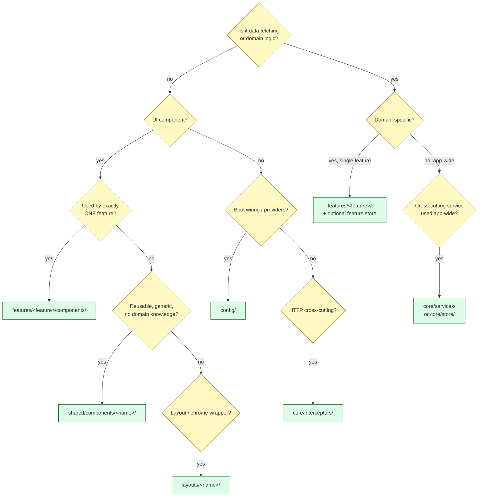

# 06 — Angular App Structure

> The SPA, opened up. Folder by folder, what each owns, where to add a feature, and the one-way import rule that keeps it sane.
> 5 diagrams: folder tree with rules, import direction, signal-store anatomy, app initializer order, "where do I put X?" decision tree.

---

## 6.1 — The folder tree (with rules)

```
ClientApp/src/app/
│
├── app.ts                       AppComponent — auth gate + <router-outlet>
├── app.routes.ts                Top-level Routes (auth | shell | error | 404)
│
├── config/                      ── Boot wiring (no runtime state) ──
│   ├── app.config.ts                 ApplicationConfig — providers, initializers
│   ├── runtime-config.ts             /config.json loader, RUNTIME_CONFIG holder
│   ├── runtime-config.model.ts
│   ├── primeng.config.ts             PrimeNG defaults + theme bindings
│   └── index.ts
│
├── core/                        ── Cross-cutting singletons (one instance app-wide) ──
│   ├── auth/
│   │   ├── auth.service.ts           Public façade (signals)
│   │   ├── auth.store.ts             AuthStore — NGRX signalStore
│   │   └── session-monitor.service.ts
│   ├── interceptors/                 8 functional interceptors (see 03/08)
│   ├── guards/                       authGuard, permissionGuard, anyPermissionGuard,
│   │                                 roleGuard, unsavedChangesGuard
│   ├── routing/
│   │   └── custom-preloader.ts       data.preload + saveData aware
│   ├── store/
│   │   ├── base/                     BaseEntityStore primitives + store-features
│   │   └── cache-invalidation-bus.service.ts
│   ├── http/                         BaseApiService, request shaping helpers
│   ├── forms/                        Reactive-forms helpers, validators
│   ├── services/                     Logger, Notification, FocusManagement, Csp,
│   │                                 LoadingService, NavbarConfigService,
│   │                                 DomainStore, StatusBannerService,
│   │                                 CorrelationContextService
│   └── models/                       RouteMetadata, CurrentUser, ApiError,
│                                     EffectivePermissions
│
├── shared/                      ── Reusable, generic, no-domain UI ──
│   ├── components/
│   │   ├── dph/                      Universal data-table (see live demo)
│   │   ├── page-header/
│   │   ├── status-badge/
│   │   ├── status-banner/
│   │   ├── empty-state/
│   │   ├── error-state/
│   │   ├── global-progress-bar/
│   │   ├── loading-overlay/
│   │   ├── skeleton-card/
│   │   ├── router-error-boundary/
│   │   └── session-expiring-dialog/
│   ├── layout/
│   │   ├── components/
│   │   │   ├── platform-navbar/      F.x — config-driven multi-domain nav
│   │   │   └── platform-footer/
│   │   ├── domains/                  Per-domain chrome factories (Finance/HR/...)
│   │   ├── providers/                NAVBAR_CONFIG_PROVIDER (Static + Backend)
│   │   └── sub-nav/                  SubNavOrchestrator + types
│   ├── directives/
│   └── pipes/
│
├── layouts/                     ── Chrome shells (one per route subtree) ──
│   ├── app-shell/                    AppShellComponent — protected
│   ├── auth-layout/                  Centered card for /auth/*
│   └── error-layout/                 Wrapper for /error/*
│
└── features/                    ── Domain slices (lazy-loaded) ──
    ├── dashboard/
    ├── auth/
    │   └── components/login.component.ts
    ├── users/
    │   └── users.routes.ts           Provides UsersStore inside the route subtree
    ├── error-pages/
    │   ├── forbidden/
    │   ├── server-error/
    │   ├── offline/
    │   ├── maintenance/
    │   └── not-found/
    └── (future feature modules…)
```

The five top-level folders are **the contract**. Putting a file in the wrong folder is reviewable; the structure is intentional.

---

## 6.2 — Import direction (one-way rule)

Imports flow **inward** only. Outer folders depend on inner; inner never imports from outer. This is the single architectural rule that keeps the SPA navigable years from now.



**The rules — strictly enforced by `dependency-cruiser` lint:**

| From | May import from | May NOT import from |
|---|---|---|
| `features/<a>/` | `core`, `shared`, `layouts` (rare), other `features/<a>/` siblings | `features/<other>/` (sibling features), `config` |
| `layouts/` | `core`, `shared` | `features`, `config` |
| `core/` | `shared`, third-party | `features`, `layouts`, `config` |
| `shared/` | third-party only | Anything in this app |
| `config/` | `core` (initializer factories), third-party | `features`, `layouts` |

**Two cross-cutting non-rules** worth knowing:
- `shared/components/dph/*` is the universal UI kit. It must be **completely generic** (no `core/auth` import, no `features/*` knowledge). If a component starts to "know" about the auth domain, it's not shared anymore — promote it to `core` or pull the auth concern out.
- The `@core` / `@shared` / `@features` / `@env` path aliases are configured in `tsconfig.json`. Use them — relative paths like `../../../core/...` make refactors painful.

---

## 6.3 — Signal-store anatomy (AuthStore as the canonical example)

Every store in the app follows this shape. Once you've read one, you've read them all.

```mermaid
flowchart TB
  classDef state  fill:#fef3c7,stroke:#92400e;
  classDef sig    fill:#dbeafe,stroke:#1e40af;
  classDef method fill:#dcfce7,stroke:#166534;
  classDef http   fill:#fae8ff,stroke:#86198f;

  subgraph Store["AuthStore — signalStore({providedIn:'root'})"]
    direction TB
    S[withState&lt;AuthState&gt;<br/>roles, permissions, bypass,<br/>expiresAt, loading, error]:::state

    subgraph Computed["Computed signals (auto-derived)"]
      C1[isStale<br/>now &gt;= expiresAt]:::sig
      C2[hasAnyPermission ...]:::sig
      C3[hasAllPermissions ...]:::sig
      C4[hasRole ...]:::sig
    end

    subgraph Methods["withMethods (mutations + side effects)"]
      M1[hydrate<br/>rxMethod → switchMap]:::method
      M2[reset<br/>back to INITIAL_STATE]:::method
    end
  end

  HTTP[/HttpClient.get<br/>/api/auth/me/permissions/]:::http

  M1 --> HTTP
  HTTP --> M1
  M1 -- patchState --> S
  S --> C1 & C2 & C3 & C4

  Guard[permissionGuard.canActivate]:::sig
  Component[Template binding<br/>{{ store.hasRole('Admin') }}]:::sig

  Guard -- reads --> C2
  Guard -- reads --> C3
  Component -- reads --> S
```

**The four ingredients of every store:**
1. **`withState<TShape>(INITIAL)`** — the single record holding everything.
2. **`withComputed`** — derived signals (auto-recompute when state changes).
3. **`withMethods`** — `patchState` mutations + `rxMethod`-wrapped async ops.
4. **`{ providedIn: 'root' }` or feature-scoped** — root for app-wide concerns (auth), route-scoped for feature data (UsersStore in `users.routes`).

**Why NGRX Signals (not classic NgRx Store):**
- No reducers, no actions, no effects — direct signal mutations.
- Strong types end-to-end (no `payload: any` action shapes).
- Devtools integration via `withDevtools` (Phase 6.2.4).
- Composition via `signalStoreFeature` — Phase 6 catalog of features (`withPersistence`, `withCacheInvalidation`, `withAsyncEntities`).

**The `BaseEntityStore` primitive** in `core/store/base/` builds on this for "list of entities" features (UsersStore, OrdersStore, …). Every entity store gets `entities`, `entitiesById`, `loading`, `error`, `lastFetchedAt`, `load()`, `loadOne(id)`, `create()`, `update()`, `remove()` — without writing them per feature.

---

## 6.4 — App initializer order (the boot pipeline)

Initializers run **sequentially** in registration order. Order matters because each can depend on the previous.

```mermaid
sequenceDiagram
  autonumber
  participant Boot as Angular bootstrap
  participant Cfg as RUNTIME_CONFIG
  participant Auth as AuthService
  participant CSP as CspViolationReporter
  participant Focus as FocusManagement
  participant App as AppComponent

  Boot->>Cfg: I1 — loadRuntimeConfig()
  Note over Cfg: GET /config.json<br/>fallback to environment.ts on 404
  Cfg-->>Boot: 'fetched' OR 'fallback'

  Boot->>Auth: I2 — refreshSession()
  Note over Auth: GET /api/auth/session<br/>populates AuthStore from claims
  Auth-->>Boot: SessionInfo OR network-tolerant null

  Boot->>CSP: I3 — register()
  Note over CSP: subscribe to 'securitypolicyviolation' DOM event
  CSP-->>Boot: ok

  Boot->>Focus: I4 — init()
  Note over Focus: subscribe to NavigationEnd<br/>focus &lt;main&gt; on route change (WCAG 2.4.3)
  Focus-->>Boot: ok

  Boot->>App: render
  Note over App: AppComponent.isLoading() = false<br/>RouterOutlet renders
```

**Each initializer's load-bearing effect:**

| # | Initializer | Why first / second / etc. |
|---|---|---|
| 1 | `loadRuntimeConfig` | Other services read RUNTIME_CONFIG in their constructors — must be populated first |
| 2 | `AuthService.refreshSession` | Drives `AppComponent.isLoading()` gate; first render needs auth state |
| 3 | `CspViolationReporter.register` | DOM event listener — order doesn't matter, but stays before app starts emitting reports |
| 4 | `FocusManagement.init` | `NavigationEnd` subscription — must be in place before the very first navigation |

**Failure tolerance:**
- I1 falls back silently (logs `runtime-config.fallback`). Never blocks boot.
- I2 swallows network errors (anonymous user). Never blocks boot.
- I3, I4 are pure subscriptions, never throw.

**Net effect:** the SPA always boots, even with no network. Failures degrade UX (no auth, default config) but never produce a white screen.

---

## 6.5 — "Where do I put X?" — decision tree

The single most useful page in this deck for a new contributor.



**Worked examples:**

| What you're adding | Folder | Why |
|---|---|---|
| New `OrdersComponent` page | `features/orders/orders.component.ts` + `features/orders/orders.routes.ts` | Domain-specific, single feature |
| `OrdersStore` | `features/orders/orders.store.ts` (route-scoped via routes file) | Feature store, lifecycle tied to navigation |
| Generic `<dph-tree>` component | `shared/components/dph/tree/` | Reusable, no domain |
| New auth role mapping logic | `core/auth/role-mapper.ts` | Cross-cutting, used by guards + components |
| `BackgroundJobMonitorService` (polls a status across the app) | `core/services/background-job-monitor.service.ts` | App-wide singleton |
| New PrimeNG default override | `config/primeng.config.ts` | Boot wiring |
| Request-signing interceptor | `core/interceptors/signing.interceptor.ts` + add to `app.config.ts` chain | HTTP cross-cutting |
| Feature-specific date pipe | `features/orders/pipes/order-date.pipe.ts` | Single feature only |
| Generic relative-time pipe | `shared/pipes/relative-time.pipe.ts` | Reusable, no domain |

**A note on `shared/layout`:** that subfolder houses the *navigation chrome* (navbar, footer, sub-nav), not the route shells (`layouts/`). The two are deliberately split: `shared/layout` is the *component library*, `layouts/` consumes it.

---

## 6.6 — Service vs Store — when to pick which

Both look similar at first glance (singleton, DI'd, methods). Here's the call.

| | Service | Store |
|---|---|---|
| Holds reactive state? | No (or trivially) | Yes — multiple signals |
| Examples | `LoggerService`, `NotificationService`, `LoadingService` | `AuthStore`, `UsersStore`, `OrdersStore` |
| Lifecycle | App-wide singleton | App-wide OR route-scoped |
| Construction | `@Injectable({ providedIn: 'root' })` | `signalStore({ providedIn: 'root' })` |
| Read by template? | Rarely | Always (signals) |
| Mutation API | Methods that side-effect | `patchState` only — pure data writes |
| Async? | RxJS in methods | `rxMethod` (or `signalMethod`) |

The line: **if it has signals consumed by templates or guards, it's a store. Otherwise it's a service.**

`AuthService` is interesting — it has signals (`isAuthenticated`, `displayName`, `email`) but is named "service" because its core role is *commanding* (login, logout, refreshSession), not *holding* (which `AuthStore` does). A pragmatic split.

---

## 6.7 — Demo script (talking points)

1. **Open §6.1 folder tree.** Five top-level folders, each with a clear job.
2. **Drill into §6.2 import direction** when someone asks "why can't `features/users` import from `features/orders`?" Show the dep-cruiser error.
3. **Drill into §6.3 store anatomy** when someone asks "is this NgRx?" — yes, NGRX Signals, but they look like neither classic NgRx nor plain services. Walk the four ingredients.
4. **Drill into §6.5 decision tree** when explaining "where to add X". Bookmark this for onboarding.

| Q | A |
|---|---|
| "Why no NgRx Store / Effects?" | Signals already model derivation; effects collapse into `rxMethod`. We have the wins (devtools, immutability, reactive) without the boilerplate. |
| "Is `shared/` a single bundle?" | No — every shared component is standalone, lazy-loadable on demand by the feature that imports it. The path alias is for ergonomics, not bundling. |
| "Where do feature flags go?" | `core/services/feature-flag.service.ts` (planned) — fed by `RUNTIME_CONFIG`, consumed via signal. |
| "Can a feature import from another feature?" | No — extract the shared piece to `core` or `shared`. If it's domain-shared (e.g. address normalizer used by Orders + Users), make a `core/services/address-normalizer.service.ts`. |
| "How do I unit-test a store?" | `TestBed.configureTestingModule({ providers: [provideHttpClientTesting(), AuthStore] })` then `inject(AuthStore)`. Existing `auth.store.spec.ts` is the template. |
| "Why is dep-cruiser linting cheaper than ESLint module rules?" | Lazy chunk discovery — dep-cruiser walks the whole import graph, ESLint sees a single file. We use both: dep-cruiser for architecture rules, ESLint for in-file rules. |

---

Continue to **07 — Routing + Guards** *(next)* — route shape, lazy loading, guard composition, preloader behavior.
