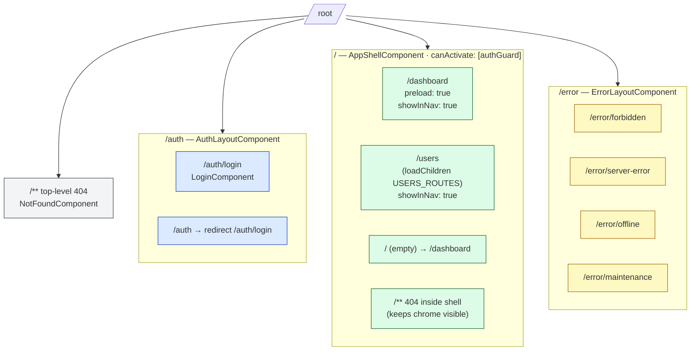
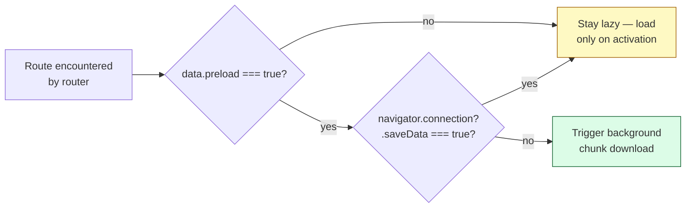
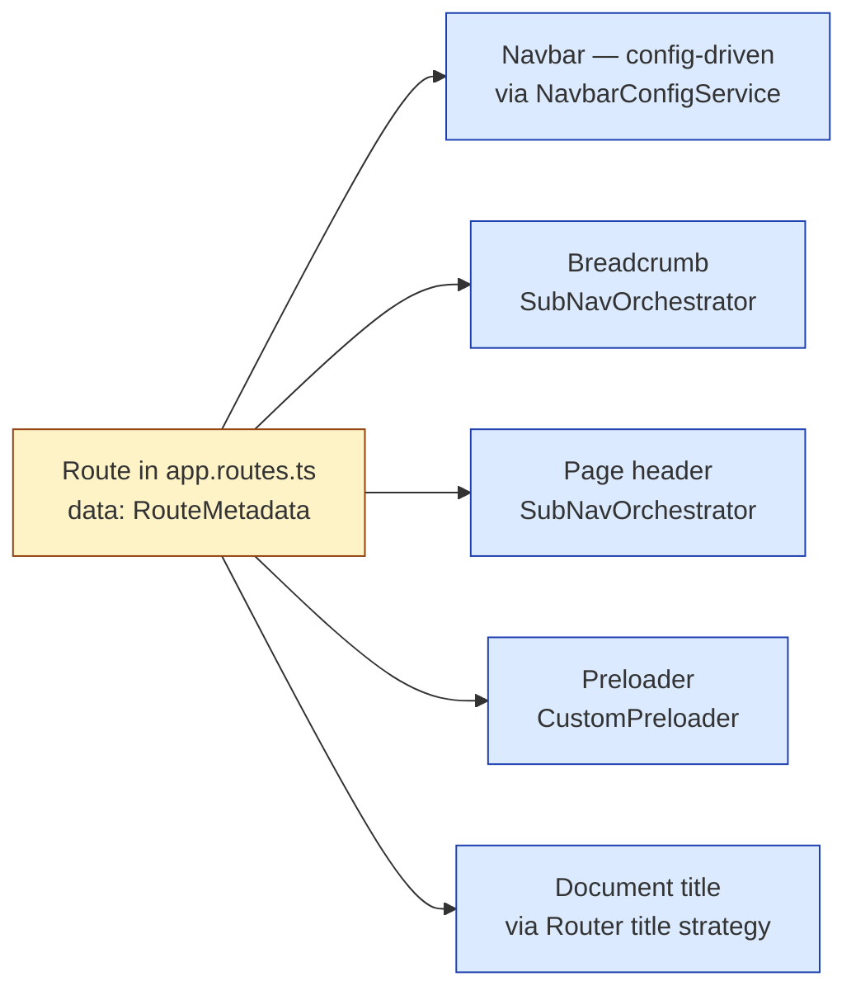

# 07 — Angular Routing + Guards

> The route tree, what guards each route, how lazy chunks load, and what the preloader is doing in the background.
> 4 diagrams: route tree, guard composition, lazy-load + preload timing, route metadata flow.

---

## 7.1 — The full route tree

Every URL the SPA accepts. Three top-level subtrees + a 404. Demo routes (`__demo/*`) are filtered out for this view.



**Three subtrees, three layouts:**

| Subtree | Layout | Auth required? | Why separate |
|---|---|---|---|
| `/auth/*` | `AuthLayoutComponent` (centered card) | No | Login page — must be reachable when anonymous |
| `/ `(everything else) | `AppShellComponent` (navbar+footer+banners) | Yes | Real app, gated |
| `/error/*` | `ErrorLayoutComponent` (fullscreen, minimal chrome) | No | Reachable mid-flow; can be hit even when auth is broken |

**Two 404s are intentional.** The shell-level 404 (`/users/typo`) keeps the navbar + footer visible so the user can navigate out. The top-level 404 (`/totally-bogus`) drops the chrome entirely — appropriate when the URL prefix doesn't even match a known subtree.

---

## 7.2 — Guard composition

Guards stack — multiple `canActivate` entries run as an AND. The order matters (cheap first, expensive later).

```mermaid
flowchart TB
  classDef gate    fill:#fef9c3,stroke:#a16207;
  classDef pass    fill:#dcfce7,stroke:#166534;
  classDef redir   fill:#fee2e2,stroke:#991b1b;

  Click[Navigate to /users/42/edit]
  G1[authGuard]:::gate
  G2[permissionGuard 'users:update']:::gate
  G3[anyPermissionGuard 'users:read', 'users:list']:::gate
  G4[unsavedChangesGuard<br/>canDeactivate]:::gate

  Pass[Activate route component]:::pass
  Redir1[/createUrlTree /auth/login<br/>+ returnUrl/]:::redir
  Redir2[/createUrlTree /error/forbidden/]:::redir
  Stop[Stop navigation,<br/>show "unsaved changes" prompt]:::redir

  Click --> G1
  G1 -- false --> Redir1
  G1 -- true --> G2
  G2 -- false --> Redir2
  G2 -- true --> G3
  G3 -- false --> Redir2
  G3 -- true --> Pass

  Pass -. user clicks away .-> G4
  G4 -- dirty form --> Stop
  G4 -- clean --> Pass
```

**The guard catalog (current):**

| Guard | Type | Reads | Returns true when |
|---|---|---|---|
| `authGuard` | functional | `AuthService.isAuthenticated()` | A session exists |
| `permissionGuard(...perms)` | factory | `AuthStore.hasAllPermissions(...)` | All listed perms are granted (AND) |
| `anyPermissionGuard(...perms)` | factory | `AuthStore.hasAnyPermission(...)` | At least one is granted (OR) |
| `roleGuard(...roles)` | factory | `AuthStore.hasRole(...)` | User has any of the listed roles |
| `unsavedChangesGuard` | functional | Component-implemented `hasUnsavedChanges()` | No dirty form, OR user confirms abandon |

**Functional guards over class guards** — every guard is `CanActivateFn = (route, state) => boolean | UrlTree`. Lighter, no `@Injectable`, DI via `inject()`, composes neatly:

```ts
canActivate: [authGuard, permissionGuard('users:update')],
```

**Fail-closed default:** if `permissionGuard` finds the permission set is empty/never-loaded, it denies. The hydration is automatic on login (`AuthService.triggerHydrationOnLogin`), so by the time a protected route mounts, permissions are loaded. If hydration *fails* (network), the user lands on `/error/forbidden` with a "try again" affordance.

**Design tradeoff: AuthStore reads vs HTTP per check.** We hydrate the permission set once per session (5-min TTL via `EffectivePermissions.TtlSeconds`) and cache in the store. Every guard read is a synchronous signal lookup — cheap. The alternative (HTTP per route activation) would multiply API load and add latency to every navigation.

---

## 7.3 — Lazy loading + preload timing

Every feature is `loadComponent` or `loadChildren` — never imported at the top level. The result: the initial bundle is `app + core + auth + dashboard` (because dashboard is `preload: true`), and everything else streams in on demand.

```mermaid
gantt
  title Initial-load + lazy-load timeline (typical)
  dateFormat X
  axisFormat %sms

  section Network
  index.html (200)            :a1, 0, 30
  main-*.js (initial bundle)  :a2, after a1, 250
  config.json                 :a3, after a2, 20
  /api/auth/session           :a4, after a3, 40

  section CPU
  Angular bootstrap            :b1, after a2, 150
  AppComponent renders         :b2, after a4, 20
  Router resolves /dashboard   :b3, after b2, 10

  section Lazy chunks
  dashboard chunk (eager)      :crit, c1, after b3, 80
  users chunk (preload — when idle) :active, c2, after c1, 200
  error-pages chunks           :c3, after c1, 0
```



**The preloader logic** (`CustomPreloader` in `core/routing/`):



**The two signals it honours:**

| Signal | Source | Effect |
|---|---|---|
| `data.preload === true` | Per-route, in `app.routes.ts` | Opt-in: only marked routes preload |
| `navigator.connection.saveData === true` | Network Information API | Skip preload entirely if user is on Data Saver |

**Why opt-in, not "preload everything":** Angular's built-in `PreloadAllModules` is too greedy. On a slow connection it wastes bandwidth on routes the user may never visit. Marking only the *next-likely* destinations (dashboard from login; user-detail from user list) gets the wins without the cost.

**Where to add `preload: true`:**
- The default landing route after sign-in (e.g. `/dashboard`) ✓ done
- The first lookup-heavy route a user typically clicks (`/users` from `/dashboard`) — *not* yet marked
- *Don't* mark settings/admin routes (most users never reach them)

**Browser support note:** Firefox + Safari don't expose `navigator.connection.saveData` — we treat that as "no signal, proceed with preload" (the conservative default).

---

## 7.4 — Route metadata (the `data` slot)

Every route can attach typed metadata in `data: { ... } satisfies RouteMetadata`. It travels with the route and is read by the chrome.



**The `RouteMetadata` shape** (from `core/models`):

```ts
interface RouteMetadata {
  /** Visible label in navbar / breadcrumb. */
  label?: string;
  /** PrimeIcon name (e.g. 'pi-home'). */
  icon?: string;
  /** Breadcrumb segment (defaults to label). */
  breadcrumb?: string;
  /** Show this route in the main nav menu? */
  showInNav?: boolean;
  /** Required permissions — drives client-side menu filtering (server is authoritative). */
  requiredPermissions?: readonly string[];
  /** Feature flag gate. */
  featureFlag?: string;
  /** Preloader opt-in. */
  preload?: boolean;
  /** Page-header config (title, subtitle, icon, primary action). */
  pageHeader?: PageHeader;
}
```

**Real example** (from `app.routes.ts`):

```ts
{
  path: 'dashboard',
  title: 'Dashboard',
  data: {
    label: 'Dashboard',
    icon: 'pi-home',
    breadcrumb: 'Dashboard',
    showInNav: true,
    preload: true,
    pageHeader: {
      title: 'Dashboard',
      subtitle: 'Phase 1 scaffold — stabilization complete.',
      icon: 'pi pi-home',
    },
  } satisfies RouteMetadata,
  loadComponent: () => import('./features/dashboard/dashboard.component')
    .then(m => m.DashboardComponent),
}
```

**One declaration → five consumers.** This is the architectural payoff: the navbar, breadcrumb, page header, preloader, and document title all read from the same source. Adding a new top-level feature is 1 route declaration + 1 component file — the chrome surfaces it automatically.

---

## 7.5 — Guard fail-mode matrix

What happens when a guard says no.

| Guard fails | Redirect | UX |
|---|---|---|
| `authGuard` (no session) | `createUrlTree(['/auth/login'], { queryParams: { returnUrl } })` | After login, user is sent back to the original URL |
| `permissionGuard` / `anyPermissionGuard` | `createUrlTree(['/error/forbidden'])` | "You don't have permission" page with retry-hydration button |
| `roleGuard` | `createUrlTree(['/error/forbidden'])` | Same |
| `unsavedChangesGuard` | (no redirect — returns false) | Browser stays on current route; component shows confirmation |
| `permissionGuard` with empty perms set due to hydration error | `createUrlTree(['/error/forbidden'])` | Same; user can manually re-attempt |

**Note:** the SPA also has a server-side authorization layer — the API returns 403, and `errorInterceptor` navigates to `/error/forbidden` regardless of the client guard. Defense in depth: client-side guards are *UX*, server-side is *authoritative*.

---

## 7.6 — Demo script (talking points)

1. **Open §7.1 route tree.** Three subtrees, three layouts, two 404s. The shape is intentional.
2. **Drill into §7.2 guard composition** when someone asks "how do I gate this route?" Show the AND-stack pattern.
3. **Drill into §7.3 lazy loading** when someone asks about bundle size. Show `preload: true` on dashboard.
4. **Drill into §7.4 route metadata** when someone asks "how does the navbar know what to show?" One declaration, five consumers.

| Q | A |
|---|---|
| "How does the SPA know the user has X permission?" | `AuthStore` — hydrated on login from `/api/auth/me/permissions`. The BFF returns a placeholder shape today; D4 will hydrate from PlatformDb. |
| "What if a guard needs an HTTP call that's not in the store?" | Resolver, not guard. Add `resolve: { foo: fooResolver }` to the route; the resolver runs after guards and the data is on `route.snapshot.data.foo`. |
| "How do I make a page require BOTH 'users:read' AND 'users:export'?" | `permissionGuard('users:read', 'users:export')` (AND-semantic by default) |
| "Can the menu hide a link the user can't access?" | Yes — navbar reads `requiredPermissions` from route metadata and filters. Server-side is still authoritative; this is just UX polish. |
| "What if the user types `/users/42/edit` directly while not signed in?" | `authGuard` → `/auth/login?returnUrl=/users/42/edit` → after login → returnUrl honoured |
| "Why two 404 routes?" | Shell-level keeps chrome (user can navigate out). Top-level drops chrome (URL didn't match any subtree at all — deeper redirect would be misleading). |
| "Can guards be async?" | Yes — return `Promise<boolean | UrlTree>` or `Observable<...>`. Currently all our guards are sync (signals are sync), so no async is needed. |

---

Continue to **08 — Angular HTTP Stack** *(next)* — interceptor reference card, opt-out matrix, BaseApiService pattern, error → form-error mapping.
