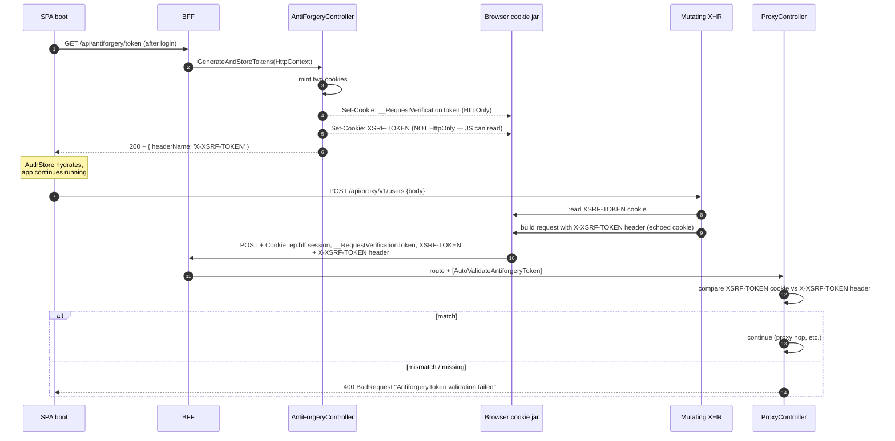

# 08 — Angular HTTP Stack

> Reference card. The 8 interceptors at-a-glance, the opt-out header matrix, the XSRF double-wiring, and the `BaseApiService` calling pattern.
> Companion to **[03 — Authenticated Request Flow](./03-Flow-Authenticated-Request.md)** which has the live sequence diagrams. This doc is the *cheat sheet* you keep open while writing feature code.

---

## 8.1 — The interceptor chain (one-page reference)

| # | Interceptor | Order rationale | Opt-out header | Default behavior |
|---|---|---|---|---|
| 1 | `correlationInterceptor` | Stamp BEFORE anything logs | (none) | Mints UUID v4 if `X-Correlation-ID` absent; pushes onto `CorrelationContextService` |
| 2 | `securityInterceptor` | Headers must be set before cache key is computed | (none) | `/api/*` only: adds `X-Requested-With`, `X-XSRF-TOKEN` (cookie value), `X-Content-Type-Options: nosniff` |
| 3 | `cacheInterceptor` | Hits short-circuit everything below | `X-Skip-Cache: true` (force fresh + repopulate) | Off by default. Opt-IN with `X-Cache-TTL: <seconds>`. GET only. 200-cap LRU. |
| 4 | `dedupInterceptor` | After cache; reuses in-flight observable via `share()` | `X-Skip-Dedup: true` | GET only; same key as cache; releases on `finalize()` |
| 5 | `loadingInterceptor` | Wraps everything network-bound (incl. retries) | `X-Skip-Loading: true` | Increments/decrements global `LoadingService.counter` |
| 6 | `loggingInterceptor` | After loading wraps so `durationMs` matches user-perceived time | (none — driven by env flag) | `log.debug('http.request')` + `log.info('http.response')` or `log.warn('http.error')` |
| 7 | `retryInterceptor` | Above error so successful retries never reach error UX | `X-Skip-Retry: true` | 5xx-only (502/503/504), GET/HEAD/OPTIONS only, exponential backoff with ±25% jitter, max from `environment.http.retries` |
| 8 | `errorInterceptor` | Bottom — final UX side-effects | `X-Skip-Error-Handling: true` | Normalize → `ApiError` (RFC 7807 aware), toast + navigate per status, re-throw |

**The cardinal rule:** *interceptors own toasts; stores own inline errors*. Stores never call `notify.error(...)` on HTTP failures — that's `errorInterceptor`'s job. Stores capture the normalized `ApiError` into a local `error()` signal for inline rendering.

---

## 8.2 — Opt-out header matrix

Each header is **stripped** by its interceptor before forwarding (servers never see them).

```ts
// Cache the role list for 10 minutes; show inline spinner instead of the global bar.
this.http.get('/api/proxy/v1/lookup/roles', {
  headers: {
    'X-Cache-TTL': '600',
    'X-Skip-Loading': 'true',
  },
});
```

| Header | Effect | Strips before forwarding | Common usage |
|---|---|---|---|
| `X-Cache-TTL: <seconds>` | Cache GET response for N seconds | yes | Lookup tables, feature flags |
| `X-Skip-Cache: true` | Bypass cache hit, refresh entry | yes | After successful mutation |
| `X-Skip-Dedup: true` | Don't join in-flight; force fresh request | yes | Polling endpoints |
| `X-Skip-Loading: true` | Don't move global progress bar | yes | Background heartbeats |
| `X-Skip-Retry: true` | First failure surfaces immediately | yes | Streaming, custom retry UX |
| `X-Skip-Error-Handling: true` | Don't toast/navigate; raw error to caller | yes | Custom error boundaries |
| `X-Correlation-ID` | Pass-through if caller provided | (kept — server logs use it) | Tunnelling broader span |

**One header you might want but don't need to set:** `X-XSRF-TOKEN`. Two interceptors set it for you:

1. Angular's built-in `HttpXsrfInterceptor` (wired via `withXsrfConfiguration(...)`) — runs *before* our chain, sets header on every same-origin mutating XHR
2. Our `securityInterceptor` (#2) — sets header on every `/api/*` call, including safe verbs

The redundancy is intentional. Mutating verbs are *required* by the BFF (`[AutoValidateAntiforgeryToken]`), and we want safe verbs to carry the header too in case any future BFF endpoint requires it.

---

## 8.3 — XSRF wiring (full picture)

The double-submit pattern, drawn end-to-end.



**Why two cookies?**
- `__RequestVerificationToken` (HttpOnly, server-side validation token). Browser can't read it; server uses it to validate.
- `XSRF-TOKEN` (readable). Angular reads it, copies to `X-XSRF-TOKEN` header. Server confirms the two match.

**The attack model:** evil.com makes a forged POST to your app. The browser auto-attaches the `ep.bff.session` cookie (would-be-evil). But evil.com cannot read `XSRF-TOKEN` (same-origin policy on cookies — even readable ones), so it cannot forge `X-XSRF-TOKEN`. Header missing → server rejects with 400.

**Why both `withXsrfConfiguration` AND `securityInterceptor`?**
- `withXsrfConfiguration` is Angular's built-in. It only fires on **mutating, same-origin** verbs.
- `securityInterceptor` fires on **every** `/api/*` call (including GETs). Belt-and-braces — guarantees the header is always present on auth-relevant traffic.

The two are wired in `app.config.ts:128-141`:

```ts
provideHttpClient(
  withXsrfConfiguration({
    cookieName: 'XSRF-TOKEN',
    headerName: 'X-XSRF-TOKEN',
  }),
  withInterceptors([
    correlationInterceptor,
    securityInterceptor,
    // ... 6 more
  ]),
),
```

---

## 8.4 — `BaseApiService` calling pattern

Every feature has a `*.api.ts` service that wraps `HttpClient` with the right defaults. Convention:

```ts
// features/users/users.api.ts
@Injectable({ providedIn: 'root' })
export class UsersApi extends BaseApiService {
  protected override readonly basePath = '/api/proxy/v1/users';

  list(params?: ListParams): Observable<UserDto[]> {
    return this.getAll<UserDto>(params, { ttl: 60 });   // X-Cache-TTL: 60
  }

  byId(id: string): Observable<UserDto> {
    return this.get<UserDto>(id);
  }

  create(body: CreateUserDto): Observable<UserDto> {
    return this.post<UserDto>(body);   // antiforgery automatic
  }

  update(id: string, body: UpdateUserDto): Observable<UserDto> {
    return this.put<UserDto>(id, body);
  }

  remove(id: string): Observable<void> {
    return this.delete(id);
  }
}
```

**`BaseApiService`** lives in `core/http/`. It wraps `HttpClient` with:
- A `basePath` field that becomes the URL prefix (so feature code never types the base path).
- Per-method `ttl?: number` option that emits `X-Cache-TTL` for you.
- `params` support — merges with `HttpParams` correctly.
- Typing — generic on response type; never returns `any`.

**Why a base service** — without it, every feature's API code re-implements URL composition, params, and TTL header math. The base service is ~80 LoC and removes ~30 LoC per feature.

**The store calls the API; the component calls the store.** This is the canonical layering:

```mermaid
flowchart LR
  classDef ui    fill:#dbeafe,stroke:#1e40af;
  classDef store fill:#dcfce7,stroke:#166534;
  classDef api   fill:#fef9c3,stroke:#a16207;
  classDef ic    fill:#fae8ff,stroke:#86198f;

  Comp[UsersListComponent<br/>template + signals]:::ui
  Store[UsersStore<br/>signalStore - feature-scoped]:::store
  Api[UsersApi<br/>BaseApiService]:::api
  IC[Interceptor chain]:::ic
  BFF[BFF / proxy]

  Comp -- store.users -- > Comp
  Comp -- store.load -- > Store
  Store -- usersApi.list -- > Api
  Api -- HttpClient.get -- > IC
  IC --> BFF
  BFF --> IC
  IC --> Api
  Api -- mapped DTOs -- > Store
  Store -- patchState -- > Store
```

**Store = single source of truth for one feature's data**. Components read signals, never `HttpClient`. The store is the only thing that calls the API service. The API service is the only thing that calls `HttpClient`. Clean three-layer cut.

---

## 8.5 — Error → form-error mapping

When the API returns 422 with `errors: { fieldName: [msg] }`, the form should highlight the bad fields without a global toast.

```mermaid
flowchart LR
  classDef rfc    fill:#fef9c3,stroke:#a16207;
  classDef norm   fill:#dbeafe,stroke:#1e40af;
  classDef map    fill:#dcfce7,stroke:#166534;
  classDef form   fill:#fae8ff,stroke:#86198f;

  Resp["API 422<br/>application/problem+json:<br/>{type, title, errors:{email:['must be unique']}}"]:::rfc
  Err[errorInterceptor.normalize<br/>→ ApiError{statusCode:422,<br/>errors:{email:['must be unique']}}]:::norm
  Mapper["ServerErrorMapperService<br/>(planned)<br/>maps ApiError.errors → FormGroup.setErrors"]:::map
  Form[FormControl 'email'<br/>has errors.serverMessage<br/>→ inline error message]:::form

  Resp --> Err --> Mapper --> Form
```

**The contract:** the BFF returns RFC 7807-compatible problems on 422. The SPA's `errorInterceptor` normalizes them. The form code calls `ServerErrorMapperService.apply(formGroup, apiError)` which copies per-field messages onto the matching `FormControl`s. No global toast for 422 — the form already shows the errors.

This is what makes "validation failures don't show two messages" a structural property of the app, not a per-feature discipline.

---

## 8.6 — Pattern catalog (when to use what)

Quick reference for "I need to call the API and..."

| Need | Pattern |
|---|---|
| Cache a GET result | Set `X-Cache-TTL: <seconds>` (or `ttl: 60` via `BaseApiService`) |
| Show only inline spinner, not global bar | Set `X-Skip-Loading: true` |
| Poll an endpoint every 5s | Set `X-Skip-Dedup: true` (and `X-Skip-Loading: true`) |
| Custom error UX (e.g. silent retry) | Set `X-Skip-Error-Handling: true`; subscribe to error in caller |
| Mutate then refresh list | Mutation → on success, list call with `X-Skip-Cache: true` |
| Two components needing the same lookup | Both call same endpoint; dedup interceptor collapses to one network trip |
| Optimistic UI | Store applies change immediately, fires API call, rolls back on error |
| File upload | `HttpClient.post(url, formData)` — interceptors transparently forward |
| Long-running export download | Use `responseType: 'blob'`; consider `X-Skip-Loading` and a per-request progress component |
| Server-Sent Events / WebSocket | Out of scope — interceptors don't see those connections |

---

## 8.7 — Anti-patterns (don't do this)

| Anti-pattern | Why it's bad | Do instead |
|---|---|---|
| `new HttpClient()` directly | Bypasses interceptor chain entirely | Always inject `HttpClient` |
| `notify.error(...)` in a store on HTTP failure | Double toast (interceptor already showed one) | Capture into store's `error()` signal for inline display |
| Catch a raw `HttpErrorResponse` | Loses the `ApiError` normalization | Catch `ApiError` (the rethrown shape) |
| Hard-code `/api/proxy/v1/...` in components | Violates layering; URL changes break N components | Components call store; store calls `*.api.ts`; api has `basePath` |
| Set `X-Cache-TTL` on a mutation | Cache is GET-only, mutation cache is a corruption bug | Use `X-Skip-Cache` on the next GET to refresh |
| `subscribe` without `takeUntilDestroyed` | Memory leak when component re-renders | Always use `takeUntilDestroyed(this.destroyRef)` or store `rxMethod` |
| Cross-feature API import | Violates one-way dep rule | Promote shared types to `core/models`, share via barrel export |

---

## 8.8 — Demo script (talking points)

1. **Open §8.1 reference card.** This is the slide you screenshot for the engineering wiki.
2. **Drill into §8.3 XSRF** for the security audit question.
3. **Drill into §8.4 calling pattern** for "where does feature code call the API from?"
4. **Drill into §8.5** for "how do form errors work?"

| Q | A |
|---|---|
| "Can I add a 9th interceptor?" | Yes — pick the right slot from §8.1's order rationale. Don't append blindly; the position matters. |
| "What's the global error boundary?" | `routerErrorBoundary` in `shared/components/router-error-boundary/` wraps the `<router-outlet>` — catches synchronous component errors and shows a fallback. HTTP errors are caught by `errorInterceptor` upstream. |
| "How do I test a store with a fake API?" | `provideHttpClientTesting()` + `HttpTestingController` — flush expected requests with mock responses. Existing `*.store.spec.ts` files are templates. |
| "Can a component call `HttpClient` directly in a pinch?" | Technically yes, but lint will complain (rule planned). The layering exists to keep the surface auditable. |
| "Where does PII scrubbing happen?" | `LoggerService` scrubs known PII fields (email, phone) before emit. `loggingInterceptor` calls `LoggerService` — never raw `console.log`. |
| "What about file uploads — do interceptors transform them?" | No — `securityInterceptor` skips `/api/*` URLs that don't match its conditions, but for `FormData` requests interceptors otherwise pass through. The body is streamed. |

---

Continue to **09 — Layout + Chrome** *(next)* — app-shell anatomy, multi-domain navbar, sub-nav orchestrator, status banners, footer.
