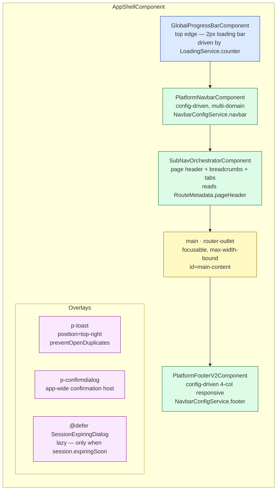
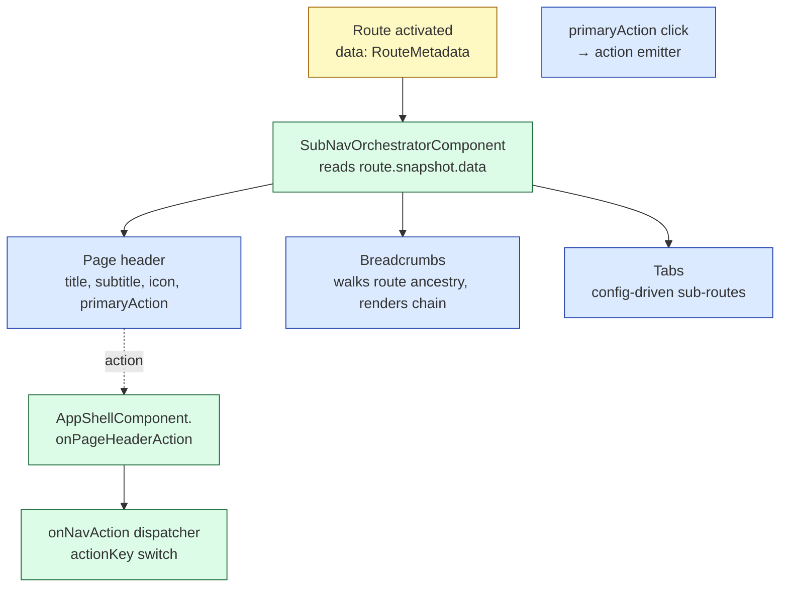
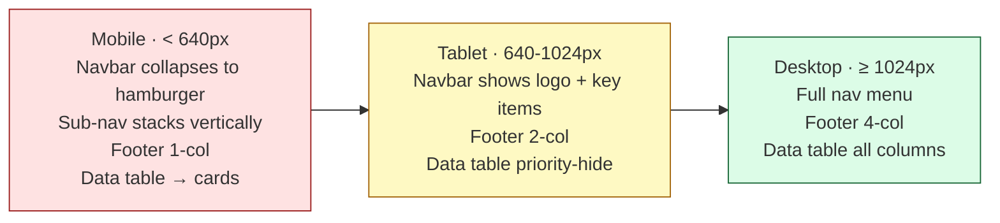

# 09 — Angular Layout + Chrome

> The "frame" that wraps every authenticated page. Multi-domain navbar, sub-nav orchestrator, status banners, footer — all config-driven, all signal-backed.
> 5 diagrams: app-shell anatomy, navbar config flow, sub-nav orchestrator, status banner pipeline, multi-domain swap.

---

## 9.1 — App-shell anatomy

`AppShellComponent` is the chrome around every protected route. Six pieces, each independently configurable.



**The DOM order matters.** The progress bar is *above* the navbar (top edge). Banners fit into `SubNavOrchestrator` (between navbar and main, planned). The footer is below `<main>`, sticky-ish via flex.

**The `<main>` discipline:**
- `role="main"` (single landmark per page)
- `id="main-content"` (focus target after navigation, see `FocusManagementService`)
- `tabindex="-1"` (focusable but not in tab order)
- `max-w-[var(--ep-content-max)]` (consistent reading width)
- `overflow-x: clip` (prevents horizontal overflow from breaking the layout — a memorialized fix)

---

## 9.2 — Navbar config flow

The navbar is **config-driven** — no `*ngIf`-soup decisions in the template. A `NavbarConfig` literal flows in, the navbar renders accordingly.

```mermaid
flowchart LR
  classDef provider fill:#fef9c3,stroke:#a16207;
  classDef service  fill:#dcfce7,stroke:#166534;
  classDef store    fill:#dbeafe,stroke:#1e40af;
  classDef cmp      fill:#fae8ff,stroke:#86198f;

  subgraph Providers["NAVBAR_CONFIG_PROVIDER (DI'd)"]
    SP[StaticNavbarConfigProvider<br/>per-domain factories]:::provider
    BP[BackendNavbarConfigProvider<br/>HTTP — future]:::provider
  end

  DS[DomainStore<br/>signal: currentDomain]:::store
  AS[AuthStore<br/>signal: roles, permissions]:::store

  Svc[NavbarConfigService<br/>signal: navbar()<br/>signal: footer()<br/>auto-reload on domain/auth change]:::service

  Shell[AppShellComponent<br/>config = chromeService.navbar]:::cmp
  Nav[PlatformNavbarComponent<br/>renders config zones]:::cmp

  SP -- selected at boot --> Svc
  BP -. future swap .-> Svc
  DS -- triggers reload --> Svc
  AS -- triggers reload --> Svc
  Svc -- signal --> Shell --> Nav
```

**The pieces:**

| Piece | Role | Key signal/method |
|---|---|---|
| `NAVBAR_CONFIG_PROVIDER` (token) | Indirection between data source and consumer | `getConfig(domain): NavbarConfig` |
| `StaticNavbarConfigProvider` | Default — uses per-domain factories from `shared/layout/domains/` | Synchronous |
| `BackendNavbarConfigProvider` | Future — fetches from BFF on domain change | Async |
| `NavbarConfigService` | Caches + reacts to changes | `navbar()`, `footer()`, `loading()`, `error()` |
| `DomainStore` | Holds the active domain | `currentDomain()` |
| `PlatformNavbarComponent` | Pure presentational | Inputs only |

**Reactive pipeline:**
1. Domain changes (e.g. user clicks "switch to Healthcare").
2. `DomainStore.currentDomain.set('healthcare')`.
3. `NavbarConfigService` effect re-runs `provider.getConfig('healthcare')`.
4. New `NavbarConfig` flows into the signal → `AppShellComponent.navbarConfig()` recomputes → `PlatformNavbarComponent` re-renders with new menu items.

No subscriptions, no manual refresh — the signal graph does it.

**RBAC defense in depth:**
- Server-side is **authoritative** (the API rejects forbidden requests with 403).
- Client-side: `PlatformNavbarComponent.NavMenuComponent` re-filters items every render against `AuthStore.permissions()`, *hides* (not disables) disallowed items.
- A user who edits the JS to add a hidden item still gets 403 on the resulting XHR.

---

## 9.3 — Sub-nav orchestrator

Between the navbar and `<main>` lives the sub-nav orchestrator. It owns the *per-page* chrome — page header, breadcrumbs, tabs, action buttons — driven by route metadata.



**One declaration drives every chrome piece:**

```ts
// in app.routes.ts
{
  path: 'users',
  data: {
    label: 'Users',                 // navbar item
    icon: 'pi-users',
    breadcrumb: 'Users',            // breadcrumb segment
    showInNav: true,                // navbar visibility
    pageHeader: {                   // sub-nav rendering
      title: 'Users',
      subtitle: 'Manage user accounts and permissions.',
      icon: 'pi pi-users',
      primaryAction: {
        label: 'New user',
        icon: 'pi pi-plus',
        actionKey: 'users.create',
      },
    },
  } satisfies RouteMetadata,
}
```

**Action dispatching is centralized.** Every action click — primary CTA, navbar widget, banner button — emits an `actionKey`. The shell has *one* dispatcher (`AppShellComponent.onNavAction`) that switches on the key. Adding a new action: add a case. No prop-drilling, no event-bus magic.

**Why centralize?** Because if "create user" can be triggered from three places (navbar `+`, page header CTA, empty-state button), they should all do the same thing — and the *same thing* is one switch case, not three.

---

## 9.4 — Status banner pipeline

System-wide announcements (maintenance windows, business alerts) appear as banners between sub-nav and content. Five severities, ARIA-aware.

```mermaid
flowchart LR
  classDef src   fill:#fef9c3,stroke:#a16207;
  classDef svc   fill:#dcfce7,stroke:#166534;
  classDef render fill:#dbeafe,stroke:#1e40af;
  classDef sev1  fill:#fee2e2,stroke:#991b1b;
  classDef sev2  fill:#fef9c3,stroke:#a16207;
  classDef sev3  fill:#dbeafe,stroke:#1e40af;
  classDef sev4  fill:#dcfce7,stroke:#166534;

  Sources[/feature code:<br/>statusBanner.show fatal, ...<br/>BFF push (planned):<br/>maintenance scheduled, etc./]:::src

  Svc[StatusBannerService<br/>signal: banners readonly Banner ]:::svc
  Host[StatusBannerHostComponent<br/>renders top-most by priority<br/>aria-live=polite or assertive]:::render

  S1[fatal<br/>aria-live=assertive]:::sev1
  S2[warning<br/>aria-live=polite]:::sev2
  S3[info<br/>aria-live=polite]:::sev3
  S4[success<br/>aria-live=polite]:::sev4

  Sources --> Svc --> Host
  Host --> S1
  Host --> S2
  Host --> S3
  Host --> S4
```

**The five severities** (with colors from the design tokens):
| Severity | Token color | When to use |
|---|---|---|
| `fatal` | `--ep-color-danger-*` | "System is down, sign-out required" |
| `warning` | `--ep-color-jessamine-*` | "Maintenance in 10 minutes" |
| `info` | `--ep-color-primary-*` | "New feature available" |
| `success` | `--ep-color-palmetto-*` | "Action completed across the platform" |
| `neutral` | `--ep-color-neutral-*` | Generic notice |

**ARIA discipline:** `fatal` uses `aria-live="assertive"` (interrupts the screen reader); everything else uses `polite` (waits its turn). This matches the actual urgency ladder.

---

## 9.5 — Multi-domain chrome swap

The architecture supports **multiple domains** (Finance, Healthcare, HR) with completely different navbar/footer per domain. This is the F-phase architecture, locked 2026-04-26.

```mermaid
flowchart TB
  classDef store fill:#fef9c3,stroke:#a16207;
  classDef factory fill:#dcfce7,stroke:#166534;
  classDef cfg fill:#dbeafe,stroke:#1e40af;
  classDef view fill:#fae8ff,stroke:#86198f;

  DS[DomainStore<br/>signal: currentDomain<br/>'finance' | 'healthcare' | 'hr']:::store

  subgraph Factories["shared/layout/domains/ — domain factories"]
    F1[finance.factory.ts<br/>buildFinanceChrome]:::factory
    F2[healthcare.factory.ts<br/>buildHealthcareChrome]:::factory
    F3[hr.factory.ts<br/>buildHrChrome]:::factory
  end

  Reg[DOMAIN_CHROME_REGISTRY<br/>readonly map domain -> factory]:::factory

  Cfg[NavbarConfigService<br/>computes signal:<br/>navbar = registry currentDomain .navbar<br/>footer = registry currentDomain .footer]:::cfg

  V[AppShellComponent<br/>renders new chrome reactively]:::view

  DS -- changes --> Cfg
  Reg -- factory lookup --> Cfg
  F1 -. registered .-> Reg
  F2 -. registered .-> Reg
  F3 -. registered .-> Reg
  Cfg --> V
```

**Per-domain styling: tone-aware widgets.** Tailwind v4's JIT-safe pattern is used: every navbar widget can declare its tone via `[data-tone="primary"]` etc., and CSS rules in `shared/layout/components/platform-navbar/*.css` style based on `[data-tone]`. Result: the same `PlatformNavbarComponent` renders in palmetto-green for Healthcare and indigo-blue for Finance without per-domain branches in the TS.

**Adding a new domain — three steps:**
1. New factory in `shared/layout/domains/<domain>.factory.ts` returning `{ navbar, footer }`.
2. Register it in `DOMAIN_CHROME_REGISTRY` (one line).
3. Update `DomainStore.allowedDomains` if it should be selectable in the UI.

The shell, navbar, footer, sub-nav, and orchestrator code stays untouched. That's the win.

---

## 9.6 — Layout responsiveness (snapshot)

The chrome is responsive at every breakpoint. Mental model:



**Where the breakpoints are defined:** `src/styles/_tokens.scss` exposes `--ep-bp-*` custom properties. `src/styles/tailwind.css` picks them up via `@theme inline`. Components use Tailwind responsive classes (`md:flex-row`, `lg:hidden`); component-internal media queries use the `m.mobile / m.tablet / m.tablet-down / m.desktop / m.wide` mixins from `_mixins.scss`.

---

## 9.7 — Demo script (talking points)

1. **Open §9.1 app-shell anatomy.** Six pieces; each is independently swappable.
2. **Drill into §9.2 navbar config flow** when someone asks "is the menu hard-coded?" Walk through DomainStore → service → component. Mention the planned BackendNavbarConfigProvider.
3. **Drill into §9.3 sub-nav orchestrator** when someone asks "how does the page title work?" One route declaration → 3 render targets.
4. **Drill into §9.5 multi-domain swap** for the "can we white-label this for a tenant?" question. Adding a domain is a 3-file change.

| Q | A |
|---|---|
| "Can we A/B test a new navbar?" | Yes — add a new `navbar-experiment.factory.ts`, register conditionally based on a feature flag in the service. |
| "How does dark mode work?" | Token swap via `:root.dark { --ep-color-* }`. Components use `var(--ep-color-*)`, never hex. (Doc: `UI-Color-Palette-Strategy.md`.) |
| "Why split sub-nav from navbar?" | Different update cadence — navbar reflects domain (rare), sub-nav reflects current route (every navigation). Different lifecycles → different components. |
| "What about footer 'sitemap' links?" | Configured in the domain factory's `FooterConfig`. 4-col responsive: brand / product / resources / legal. |
| "Where do toasts come from?" | `NotificationService.error/warn/info/success` → PrimeNG `MessageService` → `<p-toast>` in the shell. Single host, single style. |
| "Can a feature inject its own banner?" | Yes — `inject(StatusBannerService).show({ severity, title, message, autoDismissMs? })`. Auto-removes when component destroys (via `DestroyRef`). |
| "How is the global progress bar wired?" | `loadingInterceptor` increments `LoadingService.counter`; `GlobalProgressBarComponent` binds to its `isLoading()` signal — no manual subscriptions. |
| "Mobile cards vs table — which one?" | The data-table component (`shared/components/dph/data-table.component.ts`) has `responsiveMode: 'cards' | 'priority' | 'scroll'`. `'cards'` swaps below 640px. |

---

Continue to **10 — Cross-Cutting + Tradeoffs** *(next)* — observability, error model, security boundary, and the design tradeoffs in one place.
