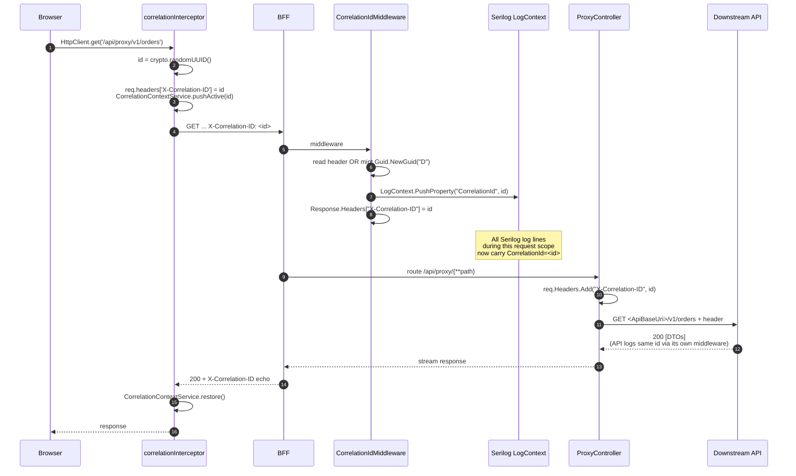
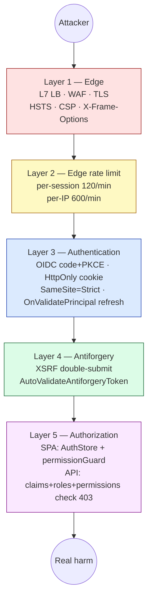
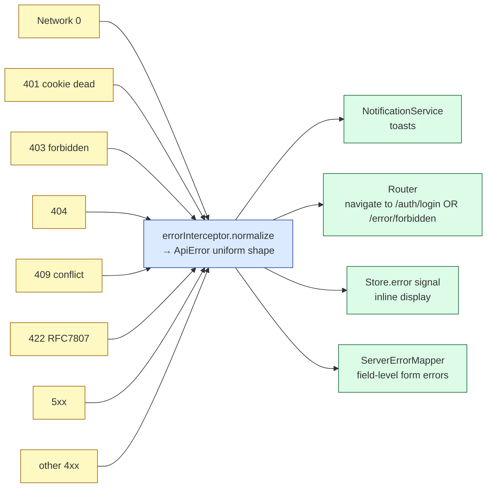
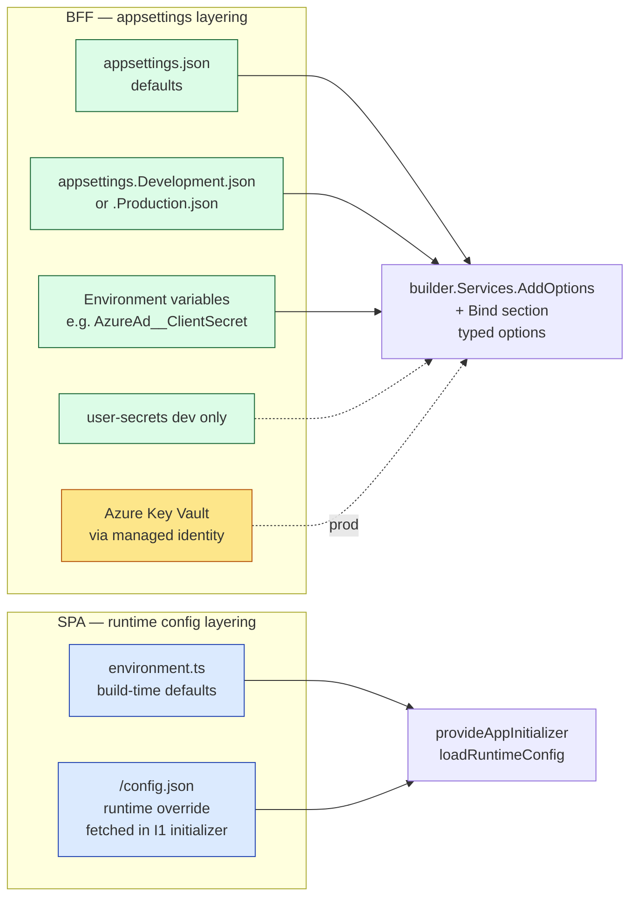
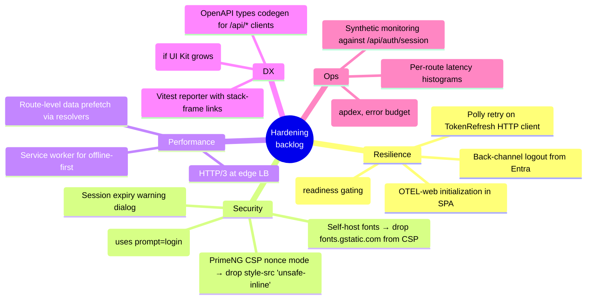

# 10 — Cross-Cutting + Tradeoffs

> Concerns that thread through every layer: observability, security, error model, configuration. Plus the architectural tradeoffs we made (and why) — collected in one place for the architects in the room.
> 4 diagrams: correlation flow, security defense layers, error model unification, future-hardening map.

---

## 10.1 — Observability — the correlation thread

A single `X-Correlation-ID` flows from the browser, through the BFF, into the API logs, and (when needed) into the DB query tag. One id, one query, one user's full session reconstructable.



**The observability triad:**

| Signal | Tool | Where collected |
|---|---|---|
| Logs | Serilog → OTLP | `Program.cs` `UseSerilog`; `LogContext` carries correlation + sub claim |
| Metrics | OpenTelemetry Meter | `SessionMetrics` for the BFF; per-domain meters in API |
| Traces | OpenTelemetry ActivitySource | (Phase 3 enhancement; SPA-side OTEL-web feeds traceparent) |

**Two sub-IDs that ride alongside `X-Correlation-ID`:**
- **`sub` claim** — the Entra user identifier. Stamped on every BFF log line via the `User.FindFirst("sub")` pattern in `ProxyController.LogHop`. Lets ops slice logs by user without joining tables.
- **W3C `traceparent`** — when OTEL-web is initialized in the SPA, the trace ID lines up 1:1 with `X-Correlation-ID`. Until then, plain UUIDs are sufficient.

**The "single id" promise** — given a user-reported error and the timestamp, you can:
1. Find the SPA-side log line in the browser console (or App Insights) by `X-Correlation-ID`.
2. Find the BFF log lines for that id (Serilog Seq query: `CorrelationId = '<id>'`).
3. Find the API log lines for the same id (same query against the API's sink).
4. Find any DB query tags (when EF logging is set to include the `EnableSensitiveDataLogging` flag in dev).

That chain is the most useful debugging affordance the architecture gives you.

---

## 10.2 — Security defense layers

Five concentric layers. An attacker has to defeat *all* of them to do real damage.



**What each layer stops:**

| Layer | Stops | Notes |
|---|---|---|
| 1. Edge | DDoS, plaintext interception, content-injection, clickjacking | TLS termination at LB; HSTS pinned 1y; CSP nonce-aware; `frame-ancestors 'self'` |
| 2. Rate limit | Brute force, scraper bots, runaway clients | OIDC callbacks exempted to not break login |
| 3. Auth | Unauthenticated access, token theft via XSS | Token never in JS; refresh server-side; SameSite=Strict |
| 4. Antiforgery | CSRF (cross-site forged mutating requests) | Double-submit pattern; SPA echoes cookie value as header |
| 5. Authz | Authenticated user reaching forbidden resource | API-side authoritative; SPA-side guards are UX |

**The trust boundary is at the BFF.** Below the BFF (API, DB) the system trusts the bearer token; above it (browser), the system trusts nothing. The browser **never** sees a Bearer token, **never** holds a refresh token, **never** holds a ClientSecret.

**Threat model the architecture defends against (selected):**
- **XSS in the SPA** → can read `XSRF-TOKEN` cookie, but cannot read `ep.bff.session` (HttpOnly) or any access token. Worst case: the attacker forces the user's session to make API calls *as the user*. Mitigation: CSP + secretlint + careful input handling.
- **CSRF from evil.com** → cookies auto-attach, but evil.com cannot read `XSRF-TOKEN` cookie (same-origin), so cannot forge `X-XSRF-TOKEN` header. Server rejects with 400.
- **Token theft via leaked logs** → tokens never logged; PII scrubbed by `LoggerService`; correlation IDs are non-sensitive.
- **Compromised BFF host** → ClientSecret in Key Vault, accessed via managed identity at runtime; rotation invalidates all sessions.
- **Compromised database** → access tokens are not in the DB (they're in cookie tickets), so DB compromise doesn't yield Entra tokens.

---

## 10.3 — Error model unification

Every error in the app — network, validation, server crash, auth — is funneled into a single shape consumed everywhere.



**The `ApiError` invariant** — every consumer (toast, redirect, store, form-mapper) sees the same fields:

```ts
interface ApiError {
  message: string;
  statusCode: number;
  code?: string;            // 'EP.Network' | 'EP.UserNotFound' | RFC 7807 type
  errors?: Record<string, string[]>;  // per-field validation
  correlationId?: string;
  timestamp: string;
}
```

**The dispatch policy** — what happens for which status:

| Status | Toast | Navigate | Form errors | Notes |
|---|---|---|---|---|
| 0 (network) | "Unable to reach the server" | (none) | (none) | Phase 10 may add `/error/offline` |
| 401 | sticky "Session expired" | `/auth/login?returnUrl=...` | (none) | BFF refresh failed |
| 403 | "Access denied" | `/error/forbidden` | (none) | Either guard miss OR API-side reject |
| 404 | (none) | (none) | (none) | Feature renders empty state |
| 409 | "Record changed" | (none) | (none) | Optimistic-concurrency rollback in store |
| 422 | (none) | (none) | per-field via mapper | Form is the single render |
| 5xx | "Server error" | (none) | (none) | After retryInterceptor exhaustion |
| Other 4xx | "Request failed (status)" | (none) | (none) | Server message echoed |

**The single rule** that makes this clean: *interceptors own toasts; stores own inline errors*.

---

## 10.4 — Configuration flow (settings everywhere)

The SPA, BFF, and API all read configuration. Different sources, different layering.



**BFF config — three layers, precedence top-to-bottom:**
1. Environment variables (`AzureAd__ClientSecret`) — highest
2. `appsettings.<Env>.json`
3. `appsettings.json` — lowest

In production, `AzureAd__ClientSecret` is **not** in any file — it comes from Key Vault via the host's managed identity. `user-secrets` is a dev-only convenience.

**SPA config — two layers:**
1. `/config.json` (fetched at runtime, in I1 initializer) — wins
2. `environment.ts` (build-time) — fallback

**Why `/config.json` matters:** the same Angular bundle ships to dev/staging/prod. Different config per env via a single static JSON file (different per environment) avoids per-env builds. The fetch in I1 has a fallback so a missing/corrupt `config.json` still boots the app.

---

## 10.5 — Tradeoff summary (the architects' cheat-sheet)

Every load-bearing decision, with the alternative we considered.

### Authentication / session

| Decision | Picked | Alternative | Why |
|---|---|---|---|
| Auth model | BFF cookie + server token swap | MSAL-in-browser | Token-out-of-browser; works on Safari ITP; simpler logout |
| Refresh strategy | `OnValidatePrincipal` hook | Background timer | Refresh per-request, no idle work, multi-pod safe |
| Cookie cross-pod sharing | Azure Key Vault data-protection ring | Sticky sessions | Stateless pods → easier scale-out |
| Logout | Front-channel + cross-tab broadcast | Back-channel logout | Simpler; tradeoff: needs broadcast for multi-tab |
| Session probe gate | Block bootstrap on `/api/auth/session` | Render then redirect | No flash of protected content |

### HTTP / proxy

| Decision | Picked | Alternative | Why |
|---|---|---|---|
| Proxy | Hand-rolled `ProxyController` | YARP | Footprint; explicit auth swap is more readable while foundation forms |
| Antiforgery | Double-submit cookie | Synchronizer-token-only | Plays well with stateless ProxyController |
| Retries | SPA-side retry interceptor | Server-side or both | Closest to user; one source of truth |
| Caching | Opt-in per call (`X-Cache-TTL`) | Cache-by-default | Opt-in is safer; every cached endpoint is a deliberate decision |

### Front-end

| Decision | Picked | Alternative | Why |
|---|---|---|---|
| State management | NGRX Signals stores | Classic NgRx · Akita · plain services | Signals + types + small surface; no reducer boilerplate |
| UI baseline | PrimeNG + Tailwind v4 cssLayer | Material · Bootstrap · purchased | Component breadth + token-driven theming; 17:1 score in evaluation |
| Themes engine | `@primeuix/themes` v2 | `@primeng/themes` (deprecated) | New canonical engine, primeng package stays v21 |
| Routing guards | Functional | Class-based | Lighter, composable; standard since Ng 16 |
| Lazy-load preloader | Custom (data.preload + saveData) | `PreloadAllModules` | Bandwidth-aware, opt-in |
| Storybook | Removed | Kept | 554 transitive deps gone; UI Kit demo route covers the same ground |

### Observability

| Decision | Picked | Alternative | Why |
|---|---|---|---|
| Logging sink | Serilog + OTLP | App Insights direct | Vendor-neutral; `StructuredLoggingSetup` shared by all hosts |
| Metrics | OpenTelemetry Meter | Prometheus client direct | Wire-compatible with any sink; same toolchain everywhere |
| Tracing | OpenTelemetry ActivitySource (in-progress) | Jaeger client direct | Vendor-neutral |
| Correlation | `X-Correlation-ID` header + `CorrelationContextService` | None or per-call ID | One id end-to-end |

### Build / repo

| Decision | Picked | Alternative | Why |
|---|---|---|---|
| BFF web framework | ASP.NET Core 10 (controllers + minimal-API) | Pure minimal-API | `[AutoValidateAntiforgeryToken]` filter needs `AddControllersWithViews` |
| Architecture lint | dependency-cruiser | ESLint module-rules-only | Walks lazy chunks; ESLint sees one file at a time |
| Diagram tooling | Mermaid in markdown | draw.io PNGs | Diff-able, no binary churn |
| Folder structure | `Setup/Middleware/Endpoints/Controllers/Services/Configuration/Observability` (BFF) and `config/core/features/layouts/shared` (SPA) | Flat by file type | Folders match concerns, not file kinds |

---

## 10.6 — Future-hardening map

Things that aren't critical today but are tracked. Useful for the architecture-future-state slide.



These are tracked in `Docs/Implementation/Compliance-TODO.md` and per-area docs. The deck's job is to make sure each is *visible* — not to schedule them.

---

## 10.7 — Demo script (talking points)

1. **Open §10.1 correlation thread.** "One ID, one query, one user's session." This is the most-asked-for affordance from ops.
2. **Drill into §10.2 security layers** for the architects' security audit moment. Five layers, what each catches.
3. **Drill into §10.3 error model** when someone asks "how do you avoid double toasts?" The single rule.
4. **Drill into §10.5 tradeoffs** for the "why didn't you use X?" round. Most pre-baked answers are here.
5. **Drill into §10.6 hardening map** for "what's next?"

| Q | A |
|---|---|
| "Where do I find the correlation ID for a specific user complaint?" | Browser network tab → response header `X-Correlation-ID`. Then `CorrelationId = '<id>'` in your Serilog query. |
| "What if `/config.json` is misconfigured at deploy?" | I1 initializer logs `runtime-config.fallback`; the SPA boots with `environment.ts` defaults. App Insights would show this as "fallback rate ≠ 0". |
| "Where would we add OWASP top-10 hardening checks?" | `secretlint` covers leaked secrets in commits; `eslint-plugin-security` covers some. Per-OWASP item: A01 → Layer 5 authz; A02 → Layer 4 antiforgery; A03 → param sanitization at API; etc. |
| "How would you stress-test this?" | Bombard `/api/proxy/v1/...` with k6/JMeter at the rate-limiter cap to see 429s arrive cleanly; then bombard above the cap to see the BFF stay healthy. |
| "What's the data-loss story on a partial deploy?" | Cookie ticket survives a BFF deploy *if* the data-protection key ring was in Key Vault before the deploy. New code, same key ring → users keep their session. |
| "What's the upgrade path to multi-region?" | Active-passive with shared Key Vault: ring is regional but synced. Active-active needs per-region cookies (no shared ring) — bigger change. |

---

Continue to **[11 — Tech Stack Matrix](./11-Tech-Stack-Matrix.md)** *(final)* — the per-layer language/framework/library/why table.
