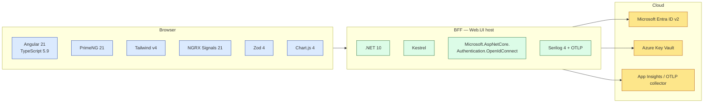

# 11 — Tech Stack Matrix

> Every technology in the UI + BFF, with the version we're on and the *why*. Use this as the closing slide of the demo, or as the onboarding cheat-sheet for a new hire.

Versions reflect `package.json` + `*.csproj` as of 2026-04-28.

---

## 11.1 — At-a-glance topology



---

## 11.2 — SPA (Angular ClientApp)

### Core framework

| Tech | Version | Why |
|---|---|---|
| Angular | 21.2 | Latest LTS line; standalone components, signals, zoneless, SSR-ready |
| TypeScript | 5.9 | Strict-mode typing across every layer; const-types support |
| RxJS | 7.8 | Required by Angular; we use it minimally — most reactivity is signals |
| Node.js | ≥22 | Build tooling baseline; aligns with Angular CLI requirements |
| npm | 11.8 (packageManager) | Pinned to keep CI reproducible |

### State + reactivity

| Tech | Version | Why |
|---|---|---|
| `@ngrx/signals` | 21.0 | Signal-based stores; idiomatic Angular 21 state management |
| `@ngrx/operators` | 21.0 | `tapResponse` and async operators that fit the signalStore lifecycle |
| `@angular-architects/ngrx-toolkit` | 21.0 | `withDevtools` for time-travel inspection |

**Why not classic NgRx Store?** Signals already model derivation; there's no need for reducers/actions/effects. We have devtools, immutability, and reactive selectors without the boilerplate.

### UI / styling

| Tech | Version | Why |
|---|---|---|
| PrimeNG | 21.1 | ~70 production-ready components (table, calendar, tree, etc.); `pt` pass-through API for per-instance overrides |
| `@primeuix/themes` | 2.0 | Canonical theme engine (replaces deprecated `@primeng/themes`); separate v2 track |
| `primeicons` | 7.0 | Icon font that ships with PrimeNG |
| Tailwind CSS | 4.2 | Utility-first via `@theme` token system; v4's cssLayer composes under PrimeNG |
| `@tailwindcss/postcss` + `@tailwindcss/vite` | 4.2 | Build integration |
| `focus-trap` | 8.0 | Modal focus management (used inside dialogs) |

**Strategy doc:** `Docs/Architecture/UI-Styling-Strategy.md` (PrimeNG + Tailwind cssLayer scored 17:1 over alternatives).

### Validation, dates, charts

| Tech | Version | Why |
|---|---|---|
| Zod | 4.3 | Runtime validation of `RUNTIME_CONFIG` and external DTOs |
| `date-fns` | 4.1 | Tree-shakeable date math; small footprint vs Moment |
| Chart.js | 4.5 | Dashboard charts; PrimeNG-compatible wrapper |

### Tooling

| Tech | Version | Purpose |
|---|---|---|
| ESLint | 9.39 | Lint + style |
| `typescript-eslint` | 8.58 | TS-aware ESLint rules |
| `@angular-eslint/*` | 21.3 | Angular-specific lint (template + TS) |
| Prettier | 3.8 | Format |
| `dependency-cruiser` | 17.3 | Architecture lint (one-way import rule §6.2) |
| Vitest | 4.0 | Unit tests (fast, ESM-native, replaces Karma+Jasmine) |
| `@vitest/coverage-v8` | 4.1 | Coverage reporter |
| jsdom | 28.0 | Headless DOM for component tests |
| Playwright | 1.59 | E2E tests + accessibility audits |
| `@axe-core/playwright` | 4.11 | a11y assertions in E2E |
| `secretlint` | 12.1 | Pre-commit + CI secret scanning |
| `eslint-plugin-security` | 3.0 | Security-pattern detection |
| `husky` | 9.1 | Git hooks |
| `lint-staged` | 16.4 | Hook: lint only changed files |
| `@commitlint/*` | 19.8 | Conventional-Commits enforcement |
| source-map-explorer | 2.5 | Bundle analysis |

**Why Vitest over Karma+Jasmine:** Karma was deprecated by Angular in 2023; Vitest is ESM-native, ~10× faster on cold starts, and reuses the Vite config. Memory note: see `feedback_ui_phase3_gotchas.md` (Vitest needs `@angular/compiler` + TestBed init).

---

## 11.3 — BFF host (.NET 10)

### Framework

| Tech | Version | Why |
|---|---|---|
| .NET | 10.0 | Latest LTS-track; required by analyzer + nullable reference types in our style |
| ASP.NET Core | 10 | Kestrel + minimal-API + MVC controllers (the latter required by `[AutoValidateAntiforgeryToken]`) |
| Nullable reference types | enabled | Catches null at compile time; matches our defensive-programming standard |
| ImplicitUsings | enabled | Less ceremony in `using`s; consistent with Microsoft template |

### Direct package references

| Package | Source | Why we depend on it directly |
|---|---|---|
| `Microsoft.AspNetCore.Authentication.OpenIdConnect` | Microsoft | The OIDC handler we configure in `PlatformAuthenticationSetup` |
| `Serilog.AspNetCore` | Serilog | The logger sink + `UseSerilog` host integration |

Most other infrastructure (rate limiter, antiforgery, controllers) is part of the framework BCL — no extra package reference needed.

### Project references (composition)

| Reference | Provides |
|---|---|
| `Enterprise.Platform.Infrastructure` | Observability primitives (`StructuredLoggingSetup`, OTel registration) |
| `Enterprise.Platform.Contracts` | Settings DTOs (`CorsSettings`, `ProxySettings`) |
| `Enterprise.Platform.Shared` | Cross-cutting constants (`HttpHeaderNames`) |

The BFF is intentionally a thin host. Most heavy lifting lives in `Infrastructure` (which serves API/Worker/BFF identically). Adding a feature to the BFF rarely requires a new project — usually just a new `Setup/Platform*.cs` and a controller.

### Authentication / identity

| Tech | Why we use it |
|---|---|
| OIDC code+PKCE flow | Confidential-client flow; defense in depth |
| Cookie scheme (`ep.bff`) | Stateless cookie ticket with `SaveTokens=true` |
| Microsoft Entra ID v2 endpoints | Modern endpoint with `name`, `roles` claims out-of-the-box |
| `IHttpClientFactory` (named clients) | Pooled HttpClients; `ep-token-refresh`, `ep-proxy-api`, etc. |

### Observability

| Tech | Why |
|---|---|
| Serilog (structured logging) | One sink, vendor-neutral; same shape across API/Worker/BFF |
| `LogContext.PushProperty("CorrelationId", ...)` | Per-request scope for log enrichment |
| `LoggerMessage` source generators | CA1848 compliance (zero allocations); fast logging |
| OpenTelemetry Meter (`SessionMetrics`) | 4 instruments — created, refreshed, refresh-failed, lifetime |
| OTLP exporter | Wire-compatible with App Insights, Honeycomb, Jaeger |

### Security

| Tech | Why |
|---|---|
| `SecurityHeadersMiddleware` (custom) | Per-request CSP nonce, full security-header set |
| `[AutoValidateAntiforgeryToken]` | Class-level filter on mutating controllers |
| ASP.NET Core rate limiter (token bucket) | Edge throttle; per-session + per-IP; OIDC-exempt |
| `IAntiforgery` framework service | Generates the token cookies |
| `LocalRedirect` / `Url.IsLocalUrl` | Open-redirect defense in `AuthController.Login/Logout` |

### Health / lifecycle

| Tech | Why |
|---|---|
| `Microsoft.Extensions.Diagnostics.HealthChecks` | Tag-based liveness + readiness split |
| `IOptionsMonitor<T>` | Hot-reload of `ProxySettings` (`ApiBaseUri` change without restart) |
| `IHostApplicationLifetime` | Graceful shutdown hooks (planned for in-flight refresh) |

---

## 11.4 — External dependencies (cloud)

| Service | Role | Critical-path? |
|---|---|---|
| Microsoft Entra ID v2 (login.microsoftonline.com) | OIDC IdP, token issuer | Login + refresh — yes; not for already-authenticated request handling |
| Microsoft Graph (graph.microsoft.com) | `/me` profile enrichment | No — `GraphUserProfileService` falls back to claims |
| Azure Key Vault | ClientSecret + data-protection key ring | Yes — needed for cookie issuance + rotation |
| Azure Front Door / L7 LB | TLS termination, WAF, edge caching | Yes (prod) |
| Application Insights (or OTLP collector) | Logs / metrics / traces sink | No — degrades silently if unreachable; logs buffer in Serilog |

**No DB dependency from the BFF.** The BFF is stateless; all persistence is in the API tier.

---

## 11.5 — Versions worth pinning attention to

A few that matter more than version numbers usually do:

| Pin | Reason |
|---|---|
| Angular **21** | Required for zoneless change detection at scale; signal-store is 21-line ecosystem |
| TypeScript **~5.9** | Tilde range — patch updates only, no surprise minor jumps mid-sprint |
| RxJS **~7.8** | Tilde range — RxJS 8 has API changes; not yet adopted |
| `.NET 10` | LTS-track; analyzer-required (CA-rules baseline) |
| PrimeNG **21** + `@primeuix/themes` **2** | Two separate version tracks intentionally — `themes` upgrades don't pull a PrimeNG major |
| Tailwind **4** | v4 cssLayer makes layered theming work; v3 didn't |

---

## 11.6 — Build / deploy artifacts

| Artifact | Built by | Output |
|---|---|---|
| Angular SPA bundle | `ng build --configuration production` | `dist/enterprise-platform-client/browser/*.js` (immutable hashes), `index.html`, static assets |
| BFF binaries | `dotnet publish` | `bin/Release/net10.0/publish/Enterprise.Platform.Web.UI.dll` |
| Bundle stats | `npm run bundle:stats` | `dist/.../stats.json` for `source-map-explorer` |
| Bundle gate | `npm run bundle:check` | Fails CI if initial bundle > budget (`scripts/bundle-check.mjs`) |
| Container image | (Dockerfile, OOS for this deck) | OCI image with SPA copied into `wwwroot/` |

**The "where does the SPA live in prod" answer:** the prod container has `dist/.../browser/*` copied into the BFF's `wwwroot/`. `UseStaticFiles()` serves it. `MapSpaFallback` catches deep links. Same single binary serves SPA + BFF endpoints.

In dev, `npm run watch` writes to `dist/`, and `SpaHostingSettings.StaticRoot` points the BFF at it — hot reload without copying files.

---

## 11.7 — Demo script (talking points — closing)

This is the closing slide. Three points:

1. **"It's all standard tech."** Angular, .NET, OIDC, Serilog, OpenTelemetry. No proprietary frameworks, no custom DSLs. A new hire with .NET + Angular experience is productive in days.

2. **"Each tool earned its slot."** PrimeNG vs Material was scored. NGRX Signals vs classic NgRx was deliberated. Vitest vs Karma was forced by deprecation. Every choice has a rationale doc.

3. **"The architecture is portable."** The BFF/SPA split would work with React + Express, Vue + ASP.NET, anything. The patterns are not Angular-specific or .NET-specific. Ours happens to be Angular + .NET because that's our team's strength.

| Q | A |
|---|---|
| "What's the upgrade cadence?" | LTS lines for Angular + .NET. We chase major versions ~2 months after release; minors as they ship. |
| "Lock files in git?" | Yes — `package-lock.json` for npm. CI uses `npm ci`. |
| "Why npm not pnpm/yarn?" | npm is the upstream Angular team's recommendation; we don't have a perf reason to switch. |
| "What's the bundle budget?" | Initial bundle <500KB gzipped; per-route lazy chunks <150KB. Enforced by `bundle:check` in CI. |
| "Are these versions in sync with the API tier?" | Largely — `.NET 10` + Serilog align. Angular is SPA-only; API uses no JS. |
| "How do I onboard?" | Read `docs/Recreation/00-INDEX.md` (11-doc step-by-step rebuild guide); spend a half-day in the UI Kit demo route to learn the design system. |

---

## End of deck — total set

```
docs/Architecture/Demo/
├── 00-INDEX.md
├── 01-System-Context.md                  6 diagrams
├── 02-Flow-Cold-Load-And-Auth.md         5 diagrams
├── 03-Flow-Authenticated-Request.md      6 diagrams
├── 04-Flow-Token-Refresh-And-Logout.md   5 diagrams
├── 05-WebUI-Internals.md                 7 diagrams
├── 06-Angular-App-Structure.md           5 diagrams
├── 07-Angular-Routing-And-Guards.md      4 diagrams
├── 08-Angular-HTTP-Stack.md              2 diagrams + 7 tables
├── 09-Angular-Layout-And-Chrome.md       5 diagrams
├── 10-Cross-Cutting-And-Tradeoffs.md     4 diagrams + 4 tradeoff tables
└── 11-Tech-Stack-Matrix.md               1 diagram + 7 tables
```

**12 documents · ~50 diagrams · ~80 tables · zero PNGs.**

Open in VS Code with the *Markdown Preview Mermaid Support* extension, or push to GitHub for inline rendering. Each doc has a "Demo script" section at the end with 5–8 anticipated Q&A — use it to control pacing during a live walk-through.
